# Admin Cancellation

## What it does

**Whole-order cancellation** — story **24.10** — done as a **two-phase** operation on a single route. Without `?confirm=true`, the call is a **write-nothing preview**: it validates and returns what *would* happen (installments to cancel, reservations to release, refund legs newest-first, total refund). With `?confirm=true`, it **executes** in one transaction: flip the order to Cancelled, cancel scheduled/failed installments (paid ones kept as history), release committed **inventory reservations** (`releaseForOrder` — this is where 24.12's booth-release logic actually lives), write the audit record, then run the **[refund](admin-refunds.md)** through the 24.9 engine. An in-flight (`processing`) charge blocks **both** phases with **409** until it settles.

## Its neighborhood

📋 **Need the exact contract?** → [Admin Cancellation contract](contract/admin-cancellation.md) (routes, params, response fields, status codes)

## Endpoints

| Method | Path | Purpose | Permission |
|---|---|---|---|
| `POST` | `/api/v1/orders/:id/cancel` | Two-phase cancel. `?confirm` omitted/false → preview (writes nothing). `?confirm=true` → execute: cancel + cascade + release inventory + refund. Body: `refund_type` (`full`\|`partial`), `amount` (partial only), mandatory `reason`, `send_notification`. | `orders.cancel` |

## Flow, read as steps

1. `cancelOrder(id, payload, confirm?)` — if `!confirm`, `previewCancel(id, payload)` returns the dry-run summary and writes nothing.
2. On `confirm=true`, `OrderCancelService.cancelOrder` opens one transaction: it takes `FOR UPDATE` locks on the order's **[PaymentTransaction](../../relationship/2-entities/payment-transaction.md)** rows; if any is `processing` it aborts with **409 CHARGE_IN_FLIGHT**.
3. It flips the order to Cancelled, cascades scheduled/failed installments → `canceled` (`next_retry_at` nulled), and calls `releaseForOrder` to return committed inventory.
4. It writes the admin audit record, commits, then runs the **refund** post-commit through the 24.9 engine: `full` = the entire remaining refundable amount (may be $0), `partial` = the given amount validated against the cap.
5. If the **refund step** fails, the order **stays canceled** and the response states the exact refund state (cancellation is not rolled back). The cancellation email ships with [24.11](admin-notifications.md).

## Why it matters / gotchas

- **Preview writes nothing — trust it.** The no-confirm call is safe to call as often as the UI needs; only `confirm=true` mutates.
- **This is where booth release lives.** Story 24.12 was never built as its own endpoint; its inventory-release requirement is satisfied by `releaseForOrder` inside this cancel.
- **In-flight charge blocks both phases.** If a Stripe charge is mid-flight, even the preview 409s — wait a minute or two and retry.
- **Cancel and refund are sequential, not atomic across the boundary.** The order is canceled in-transaction; the refund runs after commit. A refund failure leaves a canceled order + a stated refund error — by design, so a Stripe hiccup can't strand the cancellation.
- **Full refund can be $0.** A `full` cancel of an unpaid order refunds nothing and still cancels.

## Next

[Admin Refunds](admin-refunds.md) · [Admin Notifications](admin-notifications.md) · [Admin Payments & Payment Plans](admin-payments-and-plans.md)
