# Admin Notes & Audit

## What it does

The admin-only **notes bundle** on an order — story **24.14** — read and written through two routes, with **every change written to the admin audit log**. The bundle is four fields: **internal notes**, **payment memo**, **invoice note / PO number**, and **additional terms & conditions**. These are net-new columns added by 24.14; critically, they are **not** `Order.notes` (which is the exhibitor checkout idempotency-key store and stays hidden). [Admin Order Details](admin-order-details.md) *displays* this bundle; this capability *owns the write*.

## Its neighborhood

📋 **Need the exact contract?** → [Admin Notes & Audit contract](contract/admin-notes-and-audit.md) (routes, params, response fields, status codes)

## Endpoints

| Method | Path | Purpose | Permission |
|---|---|---|---|
| `GET` | `/api/v1/orders/:id/notes` | Return the four-field notes bundle for a product order. | `orders.notes.read` |
| `PATCH` | `/api/v1/orders/:id/notes` | Partial update: omitted field untouched, explicit `null` clears, trimmed-empty → `null`. One audit-log entry per **changed** field, in the same transaction. | `orders.notes.update` |
| `GET` | `/api/v1/logs/admin-audit?entity_type=order&entity_id=:id` | The permanent, non-editable audit trail for the order's note changes (existing route, reused). | *(admin-audit)* |

## Flow, read as steps

1. `getNotes(id)` → `OrderNotesService` reads the four columns off the order (404 for unknown / soft-deleted / non-product).
2. `updateNotes(id, payload, userId)` validates that **at least one** recognized field is present (else 400), trims strings (trimmed-empty stored as `null`), and writes in a `$transaction`.
3. For **each field whose value actually changed**, `recordMany` writes one `AdminAuditLog` entry inside the same transaction; unchanged values produce no entry.
4. Returns the refreshed notes bundle. The audit trail is then queryable via the existing admin-audit-log route (no new endpoint).

## Why it matters / gotchas

- **Never touch `Order.notes`.** The whole reason 24.14 exists is that `Order.notes` was already taken (checkout idempotency). The admin notes live in `internal_notes` + the three siblings.
- **Audit is per-changed-field, in-transaction.** Change two fields → two audit rows; change none of them (same values) → zero rows. The write and its audit are atomic.
- **`null` vs omitted is meaningful.** Omitting a field leaves it alone; sending `null` clears it. This is how the UI distinguishes "don't touch" from "erase".
- **This is the canonical write path.** 24.6's order details reuses it — when `payment_memo` lands here, the details card's corresponding requirement flips to delivered.

## Next

[Admin Order Details](admin-order-details.md) · [Admin Quick Actions](admin-quick-actions.md) · [Admin Cancellation](admin-cancellation.md)
