# Admin Notifications

## What it does

The **order-lifecycle emails** — two stories with no admin-facing REST route of their own: **24.11** (Order Cancellation email) and **24.15** (Payment Reminder Notifications). 24.11 sends **one cancellation/refund email per admin action** (fired by the cancel and refund flows, self-seeding its own template slugs). 24.15 is a **background-worker cron** that scans for upcoming/overdue installments and emails payment reminders — email-only, no admin endpoint; a dev-only manual trigger exists in the worker service for testing. This card exists because these are real, shipped behavior a newcomer will otherwise not find in the admin controller — they live in the mailer and the worker, not in `orders.controller.ts`.

## Its neighborhood

📋 **Need the exact contract?** → [Admin Notifications contract](contract/admin-notifications.md) (triggers, template ownership, the worker trigger)

## Endpoints

| Method | Path | Purpose | Notes |
|---|---|---|---|
| *(no REST route)* | 24.11 cancellation email | Sent by the [cancel](admin-cancellation.md) and [refund](admin-refunds.md) flows when `send_notification` is set — one email per action. | Self-seeds its slugs/templates (template-ownership rule). |
| `POST` | `background-worker-service /manual-trigger/payment-reminders/run` | **Dev-only** manual trigger to run the payment-reminder cron on demand. | Not a production/admin route; the real driver is the scheduled cron. |

## Flow, read as steps

1. **Cancellation email (24.11):** when [Admin Cancellation](admin-cancellation.md) or [Admin Refunds](admin-refunds.md) runs with `send_notification` true, the flow calls the mailer with the cancellation/refund template. One send per action — no digest, no retry loop. The story seeds its own template slugs rather than borrowing the Email & SMS epic's.
2. **Payment reminders (24.15):** a `background-worker-service` cron periodically queries orders with scheduled installments approaching or past their due date and sends reminder emails. It is email-only and idempotent per reminder; the dev-only `manual-trigger` route lets QA run it without waiting for the schedule.

## Why it matters / gotchas

- **These aren't in the admin controller.** Don't grep `orders.controller.ts` for them — 24.11 is a mailer side-effect of cancel/refund; 24.15 lives in `background-worker-service`.
- **`send_notification` is the switch.** Cancel and refund accept `send_notification`; the email fires only when it's set. The API accepted the flag before the email existed (it was wired in with 24.11).
- **One email per action.** No batching. An admin who cancels then refunds separately triggers two emails.
- **Template ownership.** Each flow seeds its **own** slugs/templates; the Email & SMS epic manages templates but does not own these order emails.
- **The worker route is dev-only.** `manual-trigger/payment-reminders/run` exists for testing; production reminders come from the cron schedule, not an admin click.

## Next

[Admin Cancellation](admin-cancellation.md) · [Admin Refunds](admin-refunds.md) · [Admin Quick Actions](admin-quick-actions.md)
