# Admin Order Details

## What it does

The **full admin aggregate** for any order — the richest read in the system — plus the two edits that hang off it. `GET /orders/:id` returns everything an admin operator needs: general info + a derived six-value **`status_display`** (D1, no enum migration), the display-only **notes** bundle, the **billing** block + additional emails, the linked **[customer](../../relationship/2-entities/company.md)**, the line-item tree (with a **flat fallback** for admin-created orders) + coupon, **fees & totals** (Balance Payable is **net of the [refund](../../relationship/2-entities/payment-transaction.md) ledger**), the **payment-plan** block (all installments via the shared C13 mapper + the next one), the **agreement**/signer block, and the derived **sales rep / source** label. Two writes ride alongside: `PATCH /orders/:id` edits billing + CC emails; `PATCH /orders/:id/sales-rep` reassigns the rep. Serves story **24.6**; consumes units owned by 24.8/24.9/24.14/24.5.

## Its neighborhood

📋 **Need the exact contract?** → [Admin Order Details contract](contract/admin-order-details.md) (routes, params, response fields, status codes)

## Endpoints

| Method | Path | Purpose | Serves |
|---|---|---|---|
| `GET` | `/api/v1/orders/:id` | Full detail aggregate across all order types. Permission `orders.view`. | 24.6-a…q, t |
| `PATCH` | `/api/v1/orders/:id` | Partial billing edit + additional-emails CC list (D5, replace-wholesale). **Status-gated** (24.6-aa): allowed only while Active; canceled/paid-in-full/refunded → 409. Permission `orders.update`. | 24.6-h, i, aa, y |
| `PATCH` | `/api/v1/orders/:id/sales-rep` | Reassign `sales_person_id` (encrypted on the wire; validated as an active Sales-Team/Admin user, cart Deal-Owner rule). Permission `orders.sales_rep.update`. | 24.6-t, u, y |

## Flow, read as steps

1. `getOrderDetails(id)` — one `order.findFirst({ where: { id, deleted_at: null } })` over the broad `ORDER_DETAILS_SELECT` (**no** company scope, **no** order_type filter) → 404 on null.
2. `resolveAdminCreatorName` resolves the polymorphic `Cart.created_by` (looked up in users only for admin carts).
3. `resolveOnsiteContacts` does the same `(company_id, show_id)` join as the exhibitor side (native copy).
4. `toDetails` derives everything: `deriveRefundedTotal`/`deriveNetPaid`/`deriveBalanceDue` (refund-aware totals), `deriveOrderStatusDisplay`, `classifyOrderItems` + `sumItemsSubtotal`, `deriveOrderSource`, `buildSalesPersonName`, `mapInstallmentRow` (24.8 C13 mapper), `buildOnsiteContacts`.
5. **Edits** go through `OrderUpdateService`: `updateOrder` (billing/emails, status gate, audited, returns the refreshed aggregate) and `reassignSalesRep` (validate target, write `sales_person_id`, audited, refreshed aggregate).

## Why it matters / gotchas

- **`Order.notes` is never here.** The aggregate exposes `internal_notes`/`payment_memo`/`invoice_note`/`additional_terms` — never `Order.notes` (the checkout idempotency store). See [Admin Notes & Audit](admin-notes-and-audit.md).
- **This card *reads*, other cards *own*.** Notes text, installments, refund flags, and agreement downloads are surfaced here but **written** by 24.14 / 24.8 / 24.9 / 24.5. The details aggregate is a consumer.
- **Balance is net of refunds.** `balance_due`/`net_paid` subtract the succeeded refund ledger — they won't match a naive `total − paid_amount`.
- **Billing edit is status-gated.** Only an Active order (pending/partially_paid/failed) is editable; canceled → 409, paid-in-full/refunded → 409 (read-only).
- **Admin sees every type.** product / subscription / ppl_addon / gift_certificate all resolve here; the exhibitor details endpoint is the scoped, thinner cousin.

## Next

[Admin Notes & Audit](admin-notes-and-audit.md) · [Admin Payments & Payment Plans](admin-payments-and-plans.md) · [Admin Quick Actions](admin-quick-actions.md) · [Exhibitor Order Details](exhibitor-order-details.md)
