# Admin Order List & Query

## What it does

The admin **order management table** — a paginated list of product orders, with **filtering, search, and sorting all expressed as query params on one endpoint**. This single card covers four stories: **24.1** (the list), **24.2** (filters), **24.3** (search), **24.4** (sorting). Unlike the exhibitor list, it is **not** company-scoped — an admin with `orders.list` sees every order. The Show-City filter dropdown is fed by an existing `GET /cities` route (24.2-d), reused rather than rebuilt.

## Its neighborhood

📋 **Need the exact contract?** → [Admin Order List & Query contract](contract/admin-order-list-and-query.md) (routes, params, response fields, status codes)

## Endpoints

| Method | Path | Purpose | Serves |
|---|---|---|---|
| `GET` | `/api/v1/orders` | Paginated list. **Filters:** `from_date`/`to_date` (created_at range), `show_city_id`, `sales_channel`. **Search:** `search` (case-insensitive across order number, customer name, company name; whitespace tokens AND-ed). **Sort:** `sort_by` (`order_number`\|`created_at`) + `sort_order` (`asc`\|`desc`). Permission `orders.list`. | 24.1, 24.2, 24.3, 24.4 |
| `GET` | `/api/v1/cities` | Existing city list — feeds the Show-City filter dropdown (reused, not built here). | 24.2-d |

## Flow, read as steps

1. `OrdersController.listOrders(query)` (permission `orders.list`) → `OrdersService.listOrders(query)`.
2. The query DTO validates and normalizes the params: pagination (`page`/`limit`, limit ≤ 100), the date range (`from_date ≤ to_date`, `YYYY-MM-DD`), `show_city_id`, `sales_channel` (`admin_sales`\|`self_service`), and the sort tuple.
3. The service builds the `where`/`orderBy` and queries **[Order](../../relationship/2-entities/order.md)** (joined to [Company](../../relationship/2-entities/company.md) and the shows' [City](../../relationship/2-entities/shows.md) for the filter), then shapes each row (order number, customer, shows, derived payment status, total, source).
4. Returns the paginated `OrderListResponseDto` (`{ data[], meta }`).

## Why it matters / gotchas

- **One endpoint, many stories.** 24.2/24.3/24.4 added *no new routes* — they are query params on 24.1's list. If you're looking for a "filters endpoint," there isn't one.
- **Not company-scoped.** This is the deliberate difference from [Exhibitor Order Listing](exhibitor-order-listing.md): admin sees all orders, gated only by the `orders.list` permission.
- **`sales_channel` is `admin_sales` | `self_service`.** It classifies how the order originated (admin-created cart vs self-service checkout) and also drives the derived source label on the row.
- **Invalid query = 400, not empty list.** A malformed date, an out-of-range limit, or a bad `sort_by` is rejected with a 400 listing the exact violations.

## Next

[Admin Order Details](admin-order-details.md) · [Exhibitor Order Listing](exhibitor-order-listing.md) · [the admin story](../1-the-story/an-admin-cancels-and-refunds-an-order.md)
