# Admin Payments & Payment Plans

## What it does

The **installment ledger and the payment-plan machinery** for an order — stories **24.7** (Manual Payment Methods → the Payments view) and **24.8** (Payment Plan Management → the plan CRUD), plus the **per-installment void** (24.6 D-z). An order's money is a list of **[PaymentTransaction](../../relationship/2-entities/payment-transaction.md)** installments: `credit_card` ones are Stripe-driven (the webhook settles them); manual ones (`bank_wire_ach`/`check`/`paypal`) are marked paid by an admin. This capability lets an admin **view** the ledger two ways, **add / reschedule / mark-paid / delete** installments, and **void** one — all guarded, race-safe, and audited. The shared **C13 installment-row mapper** (24.8) shapes every installment row consumed here and in the details aggregate.

## Its neighborhood

📋 **Need the exact contract?** → [Admin Payments & Payment Plans contract](contract/admin-payments-and-plans.md) (routes, params, response fields, status codes)

## Endpoints

| Method | Path | Purpose | Permission |
|---|---|---|---|
| `GET` | `/api/v1/orders/:id/payments` | Payments view: installment ledger (C13 mapper) + money summary + derived order-level **Paid/Unpaid** label (from the money ledger, never `Order.status`). | `orders.payments.read` |
| `GET` | `/api/v1/orders/:id/payment-plan` | Plan view: every installment + money summary + derived **Unallocated Balance** + lock state + 60/30-day date warnings. | `orders.payment-plan.read` |
| `POST` | `/api/v1/orders/:id/payment-plan/installments` | Add a scheduled installment (fits Unallocated Balance; two-phase on date warnings via `?confirm=`). | `orders.payment-plan.create` |
| `PATCH` | `/api/v1/orders/:id/payment-plan/installments/:installment_id` | **Exactly one of:** reschedule (`due_date`, two-phase) **or** `mark_as=paid`/`unpaid` (manual rows only). | `orders.payment-plan.update` |
| `DELETE` | `/api/v1/orders/:id/payment-plan/installments/:installment_id` | Delete a scheduled installment; its amount returns to Unallocated Balance. | `orders.payment-plan.delete` |
| `POST` | `/api/v1/orders/:id/payments/:transaction_id/void` | Void ONE scheduled/failed installment → `canceled` + `next_retry_at` nulled (24.6 D-z). | `orders.payments.void` |

## Flow, read as steps

1. **Two read lenses.** `GET :id/payments` (24.7) is the money-ledger view: installments + summary + a derived Paid/Unpaid label computed purely from `paid_amount` vs `total`. `GET :id/payment-plan` (24.8) is the plan view: same installments plus plan machinery — **Unallocated Balance** (`total − Σ amounts`, floored at 0), the **plan_locked** flag (once paid in full only Refund remains), and non-blocking date warnings.
2. **Add** (`POST .../installments`): amount re-checked against Unallocated Balance inside the insert transaction; manual types require a `payment_memo`; a `credit_card` installment copies its Stripe identity from an existing card installment. Date after the first show date → always 400; 60/30-day warnings → two-phase (`?confirm=`).
3. **Update** (`PATCH .../installments/:installment_id`): send **exactly one** of `due_date` (reschedule, two-phase) or `mark_as`. `mark_as=paid` records a manual installment as settled — updating `paid_amount`/`status`/`paid_in_full_at` exactly as the Stripe webhook would; `credit_card` rows are rejected. `mark_as=unpaid` reverses a manual paid marking (the one legitimate gross decrement), reopening a locked plan.
4. **Delete** (`DELETE .../installments/:installment_id`): only a scheduled row; the deletion itself returns the amount to Unallocated Balance. Audit carries a full snapshot.
5. **Void** (`POST .../payments/:transaction_id/void`): scheduled/failed → `canceled` with `next_retry_at` nulled — the terminal shape the cancel cascade writes, so no cron resurrects it.

## Why it matters / gotchas

- **Two views, one ledger.** `payments` and `payment-plan` read the *same* installments; the difference is the plan machinery (locks, warnings, Unallocated Balance) that only `payment-plan` computes. Don't build a third.
- **Credit-card rows are Stripe's.** You cannot hand-mark a `credit_card` installment paid/unpaid — the webhook is source of truth. Only manual types are hand-markable.
- **Unallocated Balance is derived, not stored.** Adding consumes it; deleting returns it. There's no column to reconcile.
- **Void ≠ delete ≠ cancel.** Void keeps the order live and cancels one installment terminally; delete frees balance on a scheduled row; whole-order [cancel](admin-cancellation.md) does the cascade. Three different routes, three different intents.
- **Two-phase on dates only.** The `?confirm=` preview applies to *date warnings* on add/reschedule — not to mark-paid/unpaid or delete.

## Next

[Admin Refunds](admin-refunds.md) · [Admin Cancellation](admin-cancellation.md) · [Admin Order Details](admin-order-details.md)
