# Admin Permissions & RBAC Wiring

> **Cross-cutting card.** This isn't an order-acting endpoint — it's the **access-control layer beneath every other admin card**. Each admin route in this guide carries a `@Permissions('orders.*')` decorator; this card explains where those keys come from, how a role gets them, and where they surface in the admin UI.

## What it does

The admin Order Management surface is **permission-gated**: all 22 routes are guarded by `@Permissions('orders.…')` (`admin-backend-api/src/admin/orders/orders.controller.ts`), checked against **21 seeded permission keys**. Those keys reach a role two ways, and both are seeded:

- **Flat permissions** — `permission.seeder.ts` seeds the 21 `orders.*` rows (module `orders`, all `is_visible: true`), exposed individually via `GET /permissions`.
- **Grouped permissions** — `permission-group.seeder.ts` bundles the same 21 keys into **8 permission groups** (module `orders`), exposed via `GET /roles/:id/permission-groups` — the module-wise checkbox UI on the **Role Permissions** screen.

Before the group wiring existed, the order permissions were queryable as flat rows but **orphaned from the grouped Role Permissions screen** (no `orders` group to toggle). The 8 groups close that gap.

## Its neighborhood

## The 8 permission groups (module `orders`)

`View Orders` is the root; every action group `depends_on` it, so enabling any action auto-pulls read access.

| Group | `depends_on` | Permission keys | Card(s) it unlocks |
|---|---|---|---|
| **View Orders** *(root)* | — | `orders.list`, `orders.view`, `orders.notes.read`, `orders.payments.read`, `orders.payment-plan.read`, `orders.refund.read` | List & Query · Order Details · Notes · Payments · Refunds (reads) |
| **Download Documents** | View Orders | `orders.agreement.read`, `orders.invoice.read` | Quick Actions |
| **Edit Order** | View Orders | `orders.update`, `orders.notes.update`, `orders.sales_rep.update` | Order Details · Notes & Audit |
| **Order Quick Actions** | View Orders | `orders.invite-user`, `orders.resend-confirmation`, `orders.resend-portal-password`, `orders.impersonate` | Quick Actions |
| **Manage Payment Plan** | View Orders | `orders.payment-plan.create`, `orders.payment-plan.update`, `orders.payment-plan.delete` | Payments & Plans |
| **Void Payment** | View Orders | `orders.payments.void` | Payments & Plans |
| **Refund Order** | View Orders | `orders.refund` | Refunds |
| **Cancel Order** | View Orders | `orders.cancel` | Cancellation |

All 21 keys mapped, each exactly once — no key is orphaned, none double-counted.

## Flow, read as steps

1. A request hits an admin order route; the `PermissionsGuard` reads the route's `@Permissions('orders.…')` metadata and checks the caller's effective permissions.
2. A role's effective permissions come from `role_permissions`, populated either by the **direct role grant** (`role.seeder.ts` lists the 21 `orders.*` keys) or by the **grouped assign flow**.
3. **Grouped assign** — `POST /roles/:id/permission-groups` takes a set of `permission_group_ids`, **resolves each group's `depends_on`** (so selecting *Cancel Order* also pulls *View Orders*), expands groups to their `permission_group_details` rows, and syncs `role_permissions`.
4. **Grouped read** — `GET /roles/:id/permission-groups` returns all groups by module with an enabled/disabled flag for that role; the `orders` module now appears here alongside `booth-agreements`, `cart`, etc.
5. Seeding order matters: `permission.seeder` runs before `permission-group.seeder`, so the 21 keys exist when the groups map to them (a missing key would only `console.warn`, never fail the seed).

## Why it matters / gotchas

- **Group module `orders` = permission module `orders` (Convention A).** The groups deliberately follow the **booth-agreements** convention — the group's `module` string equals the underlying permission `module` — not the prettified-label style used by `Cart Management` / `PPL Order`. So the Role Permissions screen shows an **`orders`** section header.
- **The group `module` string is display-only.** `permission_group_details` maps by `permission_key` lookup, independent of the module string — matching it to the permission module is a **consistency** choice, not a functional dependency.
- **`depends_on` is transitive read-safety.** You can't grant *Refund Order* / *Cancel Order* without *View Orders* coming along; a refunder can always see what they refunded.
- **`.pdf` and `.docx` share one key.** `orders.agreement.read` gates both agreement formats (one permission row, one catalog entry) — same for the two GET reads that don't split by format.
- **Two exposure surfaces, one source of truth.** `GET /permissions` (flat, filtered `is_visible: true`) and `GET /roles/:id/permission-groups` (grouped) both derive from the same seeded rows — the groups don't invent new permissions, they only *bundle* existing ones.
- **Exhibitor surface has none of this.** Order History routes are `JwtAuthGuard` + company scope, **not** permission-gated — there are no `orders.*` keys on that server.

## Next

[Admin Order Details](admin-order-details.md) · [Admin Refunds](admin-refunds.md) · [Admin Cancellation](admin-cancellation.md) · entity model: [`../relationship/`](../../relationship/README.md)
