# Admin Quick Actions

## What it does

The **per-order operational shortcuts** an admin fires from the order row/detail — story **24.5**. Seven routes, each its own permission: download the **signed agreement** (PDF or Word), download an **invoice** PDF, **invite** a portal user to the order's company, **resend** the order confirmation, **resend** the portal password, and **impersonate** the customer (log into their portal). These are side-effecting operations (emails, document generation, session cookies), not part of the details read — they're grouped here because they share the "act on this one order" shape and mirror the cart Quick Actions patterns.

## Its neighborhood

📋 **Need the exact contract?** → [Admin Quick Actions contract](contract/admin-quick-actions.md) (routes, params, response fields, status codes)

## Endpoints

| Method | Path | Purpose | Permission |
|---|---|---|---|
| `GET` | `/api/v1/orders/:id/agreement.docx` | Stream the signed booth contract as Word (cache-first). | `orders.agreement.read` |
| `GET` | `/api/v1/orders/:id/agreement.pdf` | Stream the signed contract as PDF (rendered per request). | `orders.agreement.read` |
| `GET` | `/api/v1/orders/:id/invoices/:invoiceId/invoice` | Generate/return an invoice PDF that belongs to the order; returns a URL. | `orders.invoice.read` |
| `POST` | `/api/v1/orders/:id/invite-user` | Add a portal-user email under the order's company + send the invite. | `orders.invite-user` |
| `POST` | `/api/v1/orders/:id/resend-confirmation` | Resend the confirmation email with the latest invoice attached. | `orders.resend-confirmation` |
| `POST` | `/api/v1/orders/:id/resend-portal-password` | Send the portal access/password email to the company's primary user. | `orders.resend-portal-password` |
| `POST` | `/api/v1/orders/:id/impersonate` | Log the admin into the customer portal (returns httpOnly `SBEEXHIBITOR_*` cookies). | `orders.impersonate` |

## Flow, read as steps

1. Each route resolves the order (`RawParam('id', ParseIntIdPipe)`), enforces its permission, and delegates to a focused service (`OrderAgreementDocumentService`, `OrderInvoiceDocumentService`, `OrderActionsService`).
2. **Agreement** (`.pdf`/`.docx`) share `streamAgreement` — same signed document, two formats; the Word path is cache-first (reuses the exhibitor-portal document), the PDF renders per request. Both `StreamableFile` responses.
3. **Invoice** generates/caches the PDF for an invoice that must belong to the order (else 404) and returns `{ url }`.
4. **invite-user / resend-confirmation / resend-portal-password** send exactly one email per call, with **throttle windows** (repeat sends inside ~5 min are rejected) and duplicate-user rules mirrored from the cart flow.
5. **impersonate** mints an exhibitor session as the company's primary portal user, sets `SBEEXHIBITOR_ACCESS_TOKEN`/`_REFRESH_TOKEN` cookies, and records the event in both the admin audit log and the exhibitor login log.

## Why it matters / gotchas

- **Two agreement formats, one document.** `.pdf` and `.docx` are the *same* signed snapshot; only the render/cache differs. Non-booth or unsigned orders → 404.
- **Admin invoice is invoice-LEVEL.** The path carries `:invoiceId` — admin picks a specific invoice, unlike the exhibitor's order-level "latest invoice" route. An order-level admin invoice remains a separate follow-up.
- **Throttled sends.** Confirmation and portal-password resends reject a repeat inside the throttle window with a 400 — by design, to stop double-sends.
- **Impersonation is audited and cookie-based.** It doesn't return a token in the body; it sets httpOnly cookies and logs `impersonated_by`. Requires a linked customer company (else 400).

## Next

[Admin Order Details](admin-order-details.md) · [Admin Notifications](admin-notifications.md) · [Admin Notes & Audit](admin-notes-and-audit.md)
