# Admin Refunds

## What it does

The **refund engine** — story **24.9** — that both *tells you what's refundable* and *issues the refund*. `GET :id/refund-options` returns, for every settled installment (newest first), the available methods (**Manual** always; **Stripe** only when the payment carries a Stripe charge), how much has already been refunded, and the remaining cap — plus order-level aggregates. `POST :id/refunds` issues a **Manual** (records internally, moves no money) or **Stripe** (calls the Stripe refunds API via the external service) refund against one installment, or, when the installment is omitted, fans the amount out newest-first (order-level composition). This is the **refund primitive + ledger** other capabilities consume: [Admin Cancellation](admin-cancellation.md) refunds through it, [Admin Notifications](admin-notifications.md) emails on it, and [Admin Order Details](admin-order-details.md) surfaces its net-of-ledger balance.

## Its neighborhood

📋 **Need the exact contract?** → [Admin Refunds contract](contract/admin-refunds.md) (routes, params, response fields, status codes)

## Endpoints

| Method | Path | Purpose | Permission |
|---|---|---|---|
| `GET` | `/api/v1/orders/:id/refund-options` | Per-installment eligibility (methods, already-refunded, remaining cap) + order aggregates (gross paid, net paid, order-level cap). | `orders.refund.read` |
| `POST` | `/api/v1/orders/:id/refunds` | Issue a Manual or Stripe refund: `payment_transaction_id` (per-installment) or omitted (order-level, newest-first). Mandatory `reason`; `send_notification` accepted (email ships with 24.11). | `orders.refund` |
| `POST` | `external-api-service /v1/refunds` *(internal)* | Thin `stripe.refunds.create` wrapper — one charge + amount per call, DB-free. Not public/admin. | *(internal)* |

## Flow, read as steps

1. `getRefundOptions(id)` walks the settled installments (`succeeded`/`refunded`/`refund_failed`), computes each one's already-refunded (pending + succeeded ledger rows) and remaining cap, and rolls up the order aggregates.
2. `createRefund(id, payload, userId)` validates caps and the mandatory reason, then, per targeted installment: **Manual** writes a `Refund` ledger row (no money moves); **Stripe** calls the internal `external-api-service /v1/refunds` wrapper, recording a failure as `refund_failed`.
3. An installment flips to `refunded` only when **fully** refunded; the order becomes `refunded` once **every** settled installment is.
4. Every leg is written to the **admin audit log** with the reason, inside the transaction.
5. `send_notification` is accepted now; the customer refund email is wired by [24.11](admin-notifications.md).

## Why it matters / gotchas

- **Options first, then refund.** `refund-options` is the read that powers the UI's caps and method toggles; `refunds` is the write. Issue against a stale cap and you get a 400 quoting the exact remaining amount.
- **Manual moves no money.** A Manual refund is a bookkeeping record (e.g. a wire sent outside the system); only Stripe refunds actually call Stripe.
- **Stripe needs a charge.** If the targeted installment has no `stripe_charge_id`, Stripe is unavailable — use Manual (the error says so).
- **Per-leg outcomes.** An order-level refund returns one result per leg; a single Stripe leg can fail (`refund_failed`) while others succeed.
- **This is a shared unit.** Cancellation's refund step and the refund email both build on this engine — don't reimplement refunding elsewhere.

## Next

[Admin Cancellation](admin-cancellation.md) · [Admin Payments & Payment Plans](admin-payments-and-plans.md) · [Admin Notifications](admin-notifications.md)
