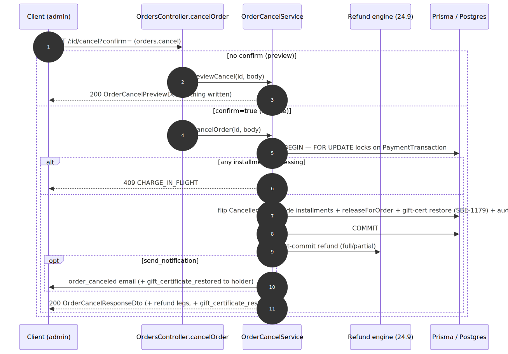

# Admin Cancellation — contract

> Exact request/response contract for the **[Admin Cancellation](../admin-cancellation.md)** capability. Authoritative source: [`admin-backend-api/src/admin/orders/orders.controller.ts`](../../../admin-backend-api/src/admin/orders/orders.controller.ts) (`cancelOrder`), services [`services/order-cancel.service.ts`](../../../admin-backend-api/src/admin/orders/services/order-cancel.service.ts) + [`services/gift-certificate-restore.service.ts`](../../../admin-backend-api/src/admin/orders/services/gift-certificate-restore.service.ts) (SBE-1179), DTO `dto/order-cancel.dto.ts`.

## Request flow

## Requests

| Method | Path | Permission | Query / Body |
|---|---|---|---|
| `POST` | `/api/v1/orders/:id/cancel` | `orders.cancel` | Query `confirm?` (omit/false = preview, writes nothing; `true` = execute). Body `CancelOrderDto`: `refund_type` (`full`\|`partial`), `amount` (partial only — omit for full), `reason` (mandatory), `send_notification?`. |

## Response — one of two shapes

**Preview (no `confirm`)** — `OrderCancelPreviewDto`: the installments that would be canceled, reservations that would be released, refund legs (newest-first), and the total refund. **Nothing is written.**

**Execute (`confirm=true`)** — `OrderCancelResponseDto`: the canceled-order summary + the refund legs actually processed. If the refund step fails, the order **stays canceled** and the response states the exact refund state. **(SBE-1179)** carries a `gift_certificate_restore` block (`gift_certificate_purchase_id`, `restored_amount`, `remaining_balance`) when the cancellation returned value to a gift certificate; null/omitted otherwise.

## Status codes

| Code | When |
|---|---|
| `200` | Preview generated **or** cancellation executed. |
| `400` | `refund_type` invalid; `amount` required for partial / forbidden for full; amount exceeds remaining cap (quotes the `$`); missing reason. |
| `403` | Missing `orders.cancel`. |
| `404` | Unknown / soft-deleted order. |
| `409` | Order already canceled; **`CHARGE_IN_FLIGHT`** — an installment charge is `processing` (blocks **both** phases; retry in a minute or two). |

---
*Regenerate diagram: `npx -y @mermaid-js/mermaid-cli mmdc -i admin-cancellation.mmd -o admin-cancellation.svg -b white -p ../../pptr.json`*
