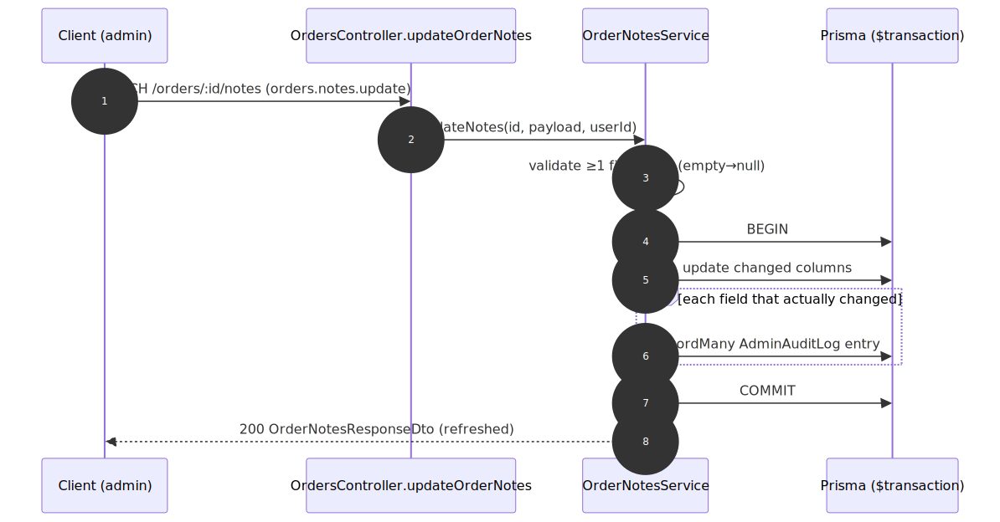

# Admin Notes & Audit — contract

> Exact request/response contract for the **[Admin Notes & Audit](../admin-notes-and-audit.md)** capability. Authoritative source: [`admin-backend-api/src/admin/orders/orders.controller.ts`](../../../admin-backend-api/src/admin/orders/orders.controller.ts) (`getOrderNotes`, `updateOrderNotes`), service [`order-notes.service.ts`](../../../admin-backend-api/src/admin/orders/order-notes.service.ts), DTO `dto/order-notes.dto.ts`.

## Request flow

## Requests

| Method | Path | Permission | Params / Body |
|---|---|---|---|
| `GET` | `/api/v1/orders/:id/notes` | `orders.notes.read` | `id`. |
| `PATCH` | `/api/v1/orders/:id/notes` | `orders.notes.update` | Body `UpdateOrderNotesDto`: any of `internal_notes`, `payment_memo`, `invoice_note` (≤255), `additional_terms`. Omitted = untouched; `null` = clear; trimmed-empty stored as `null`. At least one required. |
| `GET` | `/api/v1/logs/admin-audit?entity_type=order&entity_id=:id` | *(admin-audit)* | The note-change trail (existing route). |

## Response — `OrderNotesResponseDto` (GET and PATCH)

| Field | Type | Null | Meaning |
|---|---|---|---|
| `internal_notes` | string | yes | Free-text internal notes. |
| `payment_memo` | string | yes | Payment memo. |
| `invoice_note` | string | yes | Invoice note / PO number (≤255). |
| `additional_terms` | string | yes | Additional terms & conditions. |

> **Not exposed:** `Order.notes` (the checkout idempotency-key store) is never returned by this or any order endpoint.

## Status codes

| Code | When |
|---|---|
| `200` | Notes retrieved / updated (with per-changed-field audit rows written in the same transaction). |
| `400` | `PATCH` with no recognized field, or `invoice_note` > 255 chars. |
| `403` | Missing `orders.notes.read` / `orders.notes.update`. |
| `404` | Unknown / soft-deleted / non-product order. |

---
*Regenerate diagram: `npx -y @mermaid-js/mermaid-cli mmdc -i admin-notes-and-audit.mmd -o admin-notes-and-audit.svg -b white -p ../../pptr.json`*
