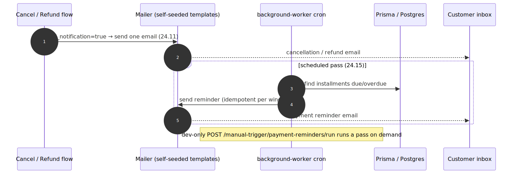

# Admin Notifications — contract

> Exact behavior contract for the **[Admin Notifications](../admin-notifications.md)** capability. These are **not** admin REST routes — they are emails from `OrderNotificationService` (24.11 + SBE-1179) and a worker cron (24.15). Authoritative source: [`admin-backend-api/src/admin/orders/services/order-notification.service.ts`](../../../admin-backend-api/src/admin/orders/services/order-notification.service.ts), the cancel/refund flows in [`services/`](../../../admin-backend-api/src/admin/orders/services), the seeders [`src/database/seeds/trigger-event.seeder.ts`](../../../admin-backend-api/src/database/seeds/trigger-event.seeder.ts) + `notification-template.seeder.ts`, and the reminder job in [`background-worker-service`](../../../background-worker-service).

## Flow

## Triggers

| Trigger (template slug) | Kind | Fired by / When | Recipient |
|---|---|---|---|
| `order_canceled` | `OrderNotificationService.sendOrderCanceledEmail` | [Cancel](../admin-cancellation.md) with `send_notification` (post-commit) | Order customer |
| `order_refunded` | `OrderNotificationService.sendOrderRefundedEmail` | Standalone [refund](../admin-refunds.md) with `send_notification` (post-commit) | Order customer |
| `gift_certificate_restored` *(SBE-1179)* | `OrderNotificationService.sendGiftCertificateRestoredEmail` | A cancel/refund that restored voucher balance | Certificate **purchaser/holder** |
| Payment reminders (24.15) | Scheduled cron | `background-worker-service` on a schedule | Order customer |
| `POST background-worker-service /manual-trigger/payment-reminders/run` | Dev-only HTTP trigger | Manual QA run of the reminder job | — |

## Contract notes

- **No admin endpoint.** Nothing here lives in `orders.controller.ts`. `send_notification` on cancel/refund is the switch.
- **Best-effort.** Both public `OrderNotificationService` methods swallow every error — a failed send never fails or rolls back the cancel/refund.
- **One email per action** — no batching, no digest. A cancel that also restores a certificate sends `order_canceled` **and** `gift_certificate_restored`.
- **Template ownership** — the three slugs are self-seeded (`trigger-event.seeder` + `notification-template.seeder`); the Email & SMS epic manages templates but does not own these order emails.
- **Idempotency** — the reminder cron does not double-send for the same installment/window.

## Status / outcomes

| Signal | When |
|---|---|
| Email sent | `send_notification=true` on a successful cancel/refund; or a reminder-eligible installment on the cron pass. |
| No email | `send_notification` unset/false; or no reminder-eligible installments. |
| `200` (dev trigger) | Manual reminder run accepted (worker service, dev only). |

---
*Regenerate diagram: `npx -y @mermaid-js/mermaid-cli mmdc -i admin-notifications.mmd -o admin-notifications.svg -b white -p ../../pptr.json`*
