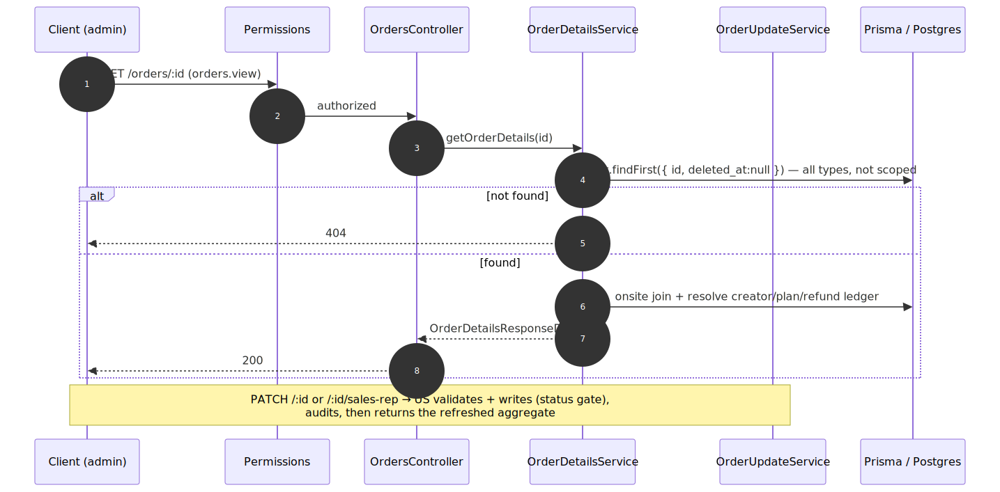

# Admin Order Details — contract

> Exact request/response contract for the **[Admin Order Details](../admin-order-details.md)** capability. Authoritative source: [`admin-backend-api/src/admin/orders/orders.controller.ts`](../../../admin-backend-api/src/admin/orders/orders.controller.ts) (`getOrderDetails`, `updateOrder`, `reassignSalesRep`), services [`services/order-details.service.ts`](../../../admin-backend-api/src/admin/orders/services/order-details.service.ts) + [`services/order-update.service.ts`](../../../admin-backend-api/src/admin/orders/services/order-update.service.ts), DTOs [`dto/order-details.dto.ts`](../../../admin-backend-api/src/admin/orders/dto/order-details.dto.ts) + `dto/order-update.dto.ts`.

## Request flow

## Requests

| Method | Path | Permission | Params / Body |
|---|---|---|---|
| `GET` | `/api/v1/orders/:id` | `orders.view` | `id` (`ParseIntIdPipe`). |
| `PATCH` | `/api/v1/orders/:id` | `orders.update` | Body `UpdateOrderDto`: any of `billing_name`/`billing_company`/`billing_address`/`billing_city`/`billing_state`/`billing_country`/`billing_zip`/`billing_phone`/`billing_email`, and `additional_emails` (string[], ≤50, replace-wholesale — `[]` clears). At least one field required. |
| `PATCH` | `/api/v1/orders/:id/sales-rep` | `orders.sales_rep.update` | Body `UpdateSalesRepDto`: `sales_person_id` (encrypted on the wire; must be an active Sales-Team/Admin user). |

## Response — `OrderDetailsResponseDto` (all three routes return the refreshed aggregate)

Top-level groups (each PATCH returns the **refreshed** aggregate):

| Group | Key fields | Notes |
|---|---|---|
| General | `id`, `order_number`, `order_type`, `status`, `status_display`, `created_at`, `currency` | `status_display` = derived six-value label (D1, no enum migration). |
| Notes (display-only) | `internal_notes`, `payment_memo`, `invoice_note`, `additional_terms` | Written by [24.14](../admin-notes-and-audit.md); **never** `Order.notes`. |
| Billing | `billing{ …, additional_emails[] }` | Editable via `PATCH :id` (status-gated). |
| Customer | `customer{ company_id, company_name }` | Link to the company + its other orders. |
| Source | `source` | Derived rep/channel label (D3). |
| Line items | `shows[]`, `line_items{ booths, add_ons, sponsorships, other }`, `coupon_code` | Flat fallback for admin-created orders. |
| Onsite | `onsite_contacts[]` | Per-show contact or null (same join as exhibitor). |
| Totals | `totals{ items_subtotal, setup_fees, cleaning_fees, fees_total, subtotal, discount, tax, total, paid_amount, refunded_total, net_paid, balance_due, total_savings }` | `balance_due`/`net_paid` are **net of the refund ledger** (24.9). |
| Payment plan | `payment_plan{ saved_plan, installments[], next_installment }` | Installments via the 24.8 C13 mapper. |
| Agreement | `agreement{ signer, signed_at, signed_agreement_url, manual_agreement_url, is_manual_bypass }` | Live downloads via [24.5](../admin-quick-actions.md). |

## Status codes

| Code | When |
|---|---|
| `200` | Aggregate / refreshed aggregate returned. |
| `400` | Bad id, or `PATCH` with no updatable field / invalid email / >50 emails / invalid `sales_person_id`. |
| `403` | Missing the route's permission. |
| `404` | Unknown / soft-deleted order (and non-product for the two PATCHes). |
| `409` | `PATCH :id` on a canceled order, or a paid-in-full/refunded (read-only) order; concurrent-change conflict. |

---
*Regenerate diagram: `npx -y @mermaid-js/mermaid-cli mmdc -i admin-order-details.mmd -o admin-order-details.svg -b white -p ../../pptr.json`*
