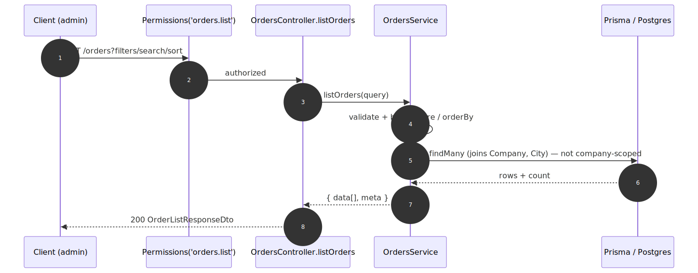

# Admin Order List & Query — contract

> Exact request/response contract for the **[Admin Order List & Query](../admin-order-list-and-query.md)** capability. Authoritative source: [`admin-backend-api/src/admin/orders/orders.controller.ts`](../../../admin-backend-api/src/admin/orders/orders.controller.ts) (`listOrders`), service [`orders.service.ts`](../../../admin-backend-api/src/admin/orders/orders.service.ts), DTO barrel [`dto/`](../../../admin-backend-api/src/admin/orders/dto).

## Request flow

## Requests

| Method | Path | Permission | Query params |
|---|---|---|---|
| `GET` | `/api/v1/orders` | `orders.list` | `page`, `limit` (≤100), `search` (≤100; order# + customer + company, AND-ed tokens), `from_date`/`to_date` (`YYYY-MM-DD`, from ≤ to), `show_city_id` (+int), `sales_channel` (`admin_sales`\|`self_service`), `sort_by` (`order_number`\|`created_at`, default `created_at`), `sort_order` (`asc`\|`desc`, default `desc`) |
| `GET` | `/api/v1/cities` | *(existing)* | Feeds the Show-City filter dropdown (reused). |

## Response — `OrderListResponseDto`

| Field | Type | Null | Meaning |
|---|---|---|---|
| `data` | `OrderListItemDto[]` | no | Orders for the current page (order#, customer/company, shows, derived payment status, total, source label). |
| `meta` | `PaginationMetaDto` | no | Pagination metadata. |

## Status codes

| Code | When |
|---|---|
| `200` | Orders retrieved. |
| `400` | Invalid query — e.g. `Limit cannot exceed 100`, `from_date must be on or before to_date`, `sales_channel must be one of: admin_sales, self_service`, `sort_by must be one of: order_number, created_at`. |
| `401` / `403` | Unauthenticated / missing `orders.list`. |

---
*Regenerate diagram: `npx -y @mermaid-js/mermaid-cli mmdc -i admin-order-list-and-query.mmd -o admin-order-list-and-query.svg -b white -p ../../pptr.json`*
