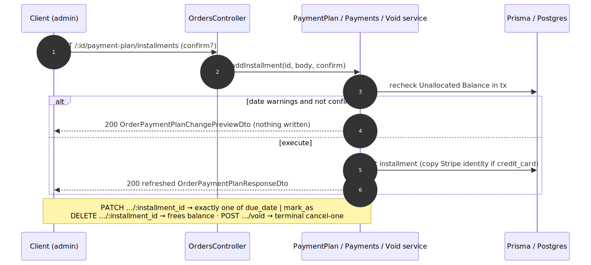

# Admin Payments & Payment Plans — contract

> Exact request/response contract for the **[Admin Payments & Payment Plans](../admin-payments-and-plans.md)** capability. Authoritative source: [`admin-backend-api/src/admin/orders/orders.controller.ts`](../../../admin-backend-api/src/admin/orders/orders.controller.ts) (`getPayments`, `getPaymentPlan`, `addPaymentPlanInstallment`, `updatePaymentPlanInstallment`, `deletePaymentPlanInstallment`, `voidPayment`), services [`services/order-payments.service.ts`](../../../admin-backend-api/src/admin/orders/services/order-payments.service.ts), [`services/order-payment-plan.service.ts`](../../../admin-backend-api/src/admin/orders/services/order-payment-plan.service.ts), [`services/order-payment-void.service.ts`](../../../admin-backend-api/src/admin/orders/services/order-payment-void.service.ts).

## Request flow

## Requests

| Method | Path | Permission | Params / Body / Query |
|---|---|---|---|
| `GET` | `/api/v1/orders/:id/payments` | `orders.payments.read` | `id`. → `OrderPaymentsResponseDto`. |
| `GET` | `/api/v1/orders/:id/payment-plan` | `orders.payment-plan.read` | `id`. → `OrderPaymentPlanResponseDto`. |
| `POST` | `/api/v1/orders/:id/payment-plan/installments` | `orders.payment-plan.create` | Body `AddOrderInstallmentDto`: `amount`, `due_date`, `payment_type` (`credit_card`\|`bank_wire_ach`\|`check`\|`paypal`), `payment_memo` (required for manual types). Query `confirm?` (two-phase on date warnings). |
| `PATCH` | `/api/v1/orders/:id/payment-plan/installments/:installment_id` | `orders.payment-plan.update` | Body `UpdateOrderInstallmentDto`: **exactly one** of `due_date` (reschedule, two-phase via `confirm?`) or `mark_as` (`paid`\|`unpaid`, manual rows only). |
| `DELETE` | `/api/v1/orders/:id/payment-plan/installments/:installment_id` | `orders.payment-plan.delete` | `id`, `installment_id`. Scheduled rows only. |
| `POST` | `/api/v1/orders/:id/payments/:transaction_id/void` | `orders.payments.void` | `id`, `transaction_id`. Scheduled/failed only → `OrderVoidPaymentResponseDto` (C13 row, status `canceled`). |

Two-phase responses (`POST installments`, `PATCH …due_date`) return **either** `OrderPaymentPlanChangePreviewDto` (warnings, nothing written — resend `?confirm=true`) **or** the refreshed `OrderPaymentPlanResponseDto`.

## Response — `OrderPaymentPlanResponseDto` (shape)

| Group | Key fields |
|---|---|
| Installments | `installments[]` — each: `invoice_number` (null until settled), `payment_type`, `payment_memo`, `date`, `status` + milestone-status label, `amount` (C13 mapper). |
| Money summary | `total`, `paid_amount` (gross), `balance_due`, `unallocated_balance` (derived `total − Σ amounts`, floored 0). |
| Plan state | `plan_locked` (true once paid in full — only Refund remains), date `warnings[]` (60/30-day, non-blocking). |

`OrderPaymentsResponseDto` is the same installment ledger + money summary **plus** a derived order-level **Paid/Unpaid** label (from `paid_amount` vs `total`, never `Order.status`), **without** the plan machinery.

## Status codes

| Code | When |
|---|---|
| `200` | Read / write done (or two-phase warnings preview). |
| `400` | Amount exceeds Unallocated Balance; date after first show date; manual type missing memo; credit_card add without an existing card installment; `PATCH` not exactly one of `due_date`/`mark_as`; hand-marking a `credit_card` row. |
| `403` | Missing the route's permission. |
| `404` | Unknown / soft-deleted / non-product order; unknown installment; (void) transaction not on this order. |
| `409` | Plan locked (paid in full); "only a scheduled installment can be rescheduled/deleted"; "only a scheduled or failed installment can be marked Paid / voided"; concurrent-change conflict. |

---
*Regenerate diagram: `npx -y @mermaid-js/mermaid-cli mmdc -i admin-payments-and-plans.mmd -o admin-payments-and-plans.svg -b white -p ../../pptr.json`*
