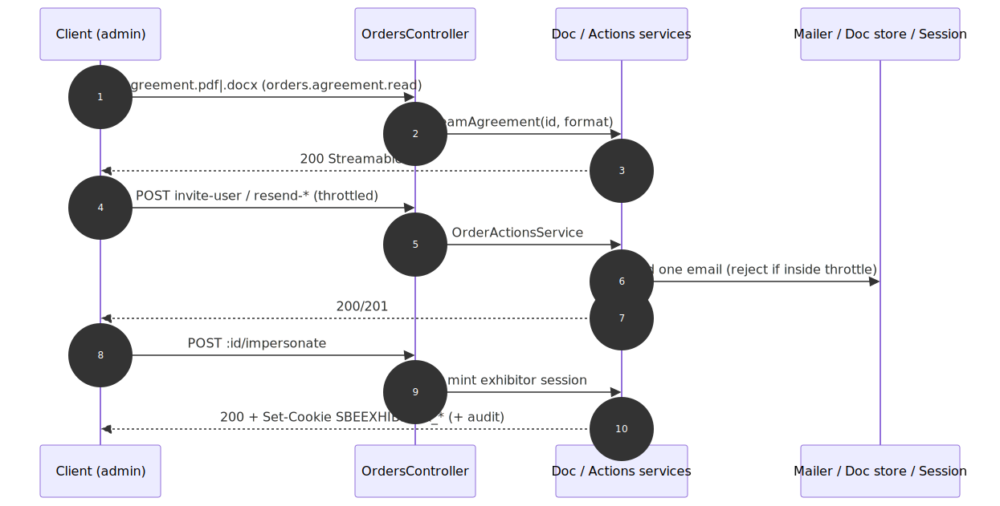

# Admin Quick Actions — contract

> Exact request/response contract for the **[Admin Quick Actions](../admin-quick-actions.md)** capability. Authoritative source: [`admin-backend-api/src/admin/orders/orders.controller.ts`](../../../admin-backend-api/src/admin/orders/orders.controller.ts) (`downloadAgreementDocx`/`Pdf`, `downloadInvoice`, `inviteUser`, `resendConfirmation`, `resendPortalPassword`, `impersonate`), services [`services/order-agreement-document.service.ts`](../../../admin-backend-api/src/admin/orders/services/order-agreement-document.service.ts), [`services/order-invoice-document.service.ts`](../../../admin-backend-api/src/admin/orders/services/order-invoice-document.service.ts), [`services/order-actions.service.ts`](../../../admin-backend-api/src/admin/orders/services/order-actions.service.ts).

## Request flow

## Requests

| Method | Path | Permission | Params / Body | Returns |
|---|---|---|---|---|
| `GET` | `/api/v1/orders/:id/agreement.docx` | `orders.agreement.read` | `id` | `StreamableFile` (Word) |
| `GET` | `/api/v1/orders/:id/agreement.pdf` | `orders.agreement.read` | `id` | `StreamableFile` (PDF) |
| `GET` | `/api/v1/orders/:id/invoices/:invoiceId/invoice` | `orders.invoice.read` | `id`, `invoiceId` | `{ url }` (`OrderInvoiceUrlResponseDto`) |
| `POST` | `/api/v1/orders/:id/invite-user` | `orders.invite-user` | Body `InviteOrderUserDto`: `email` | `OrderInviteUserResponseDto` |
| `POST` | `/api/v1/orders/:id/resend-confirmation` | `orders.resend-confirmation` | `id` | `OrderResendConfirmationResponseDto` |
| `POST` | `/api/v1/orders/:id/resend-portal-password` | `orders.resend-portal-password` | `id` | `OrderResendPortalPasswordResponseDto` |
| `POST` | `/api/v1/orders/:id/impersonate` | `orders.impersonate` | `id` | `OrderImpersonateResponseDto` + `Set-Cookie: SBEEXHIBITOR_*` |

## Notes on shape

- **Agreement** routes stream bytes (`Content-Disposition: attachment`), not JSON. `.pdf` and `.docx` are the same signed document; `.docx` is cache-first, `.pdf` renders per request.
- **Invoice** returns a URL to a generated/cached PDF (async-style download), invoice-LEVEL (a specific `:invoiceId` that must belong to the order).
- **impersonate** returns the customer summary in the body and sets httpOnly `SBEEXHIBITOR_ACCESS_TOKEN` / `SBEEXHIBITOR_REFRESH_TOKEN` cookies; it records `impersonated_by` in the admin audit + exhibitor login logs.

## Status codes

| Code | When |
|---|---|
| `200` | Agreement stream / invoice URL / resend done / impersonation done. |
| `201` | `invite-user` (invitation created). |
| `400` | `agreement.*`: non-booth order; `resend-*`: throttle window hit (~5 min) or no billing email; `impersonate`: no linked customer company; `invite-user`: invalid email. |
| `403` | Missing the route's permission. |
| `404` | Unknown / soft-deleted / non-product order; unsigned agreement; invoice not on this order. |

---
*Regenerate diagram: `npx -y @mermaid-js/mermaid-cli mmdc -i admin-quick-actions.mmd -o admin-quick-actions.svg -b white -p ../../pptr.json`*
