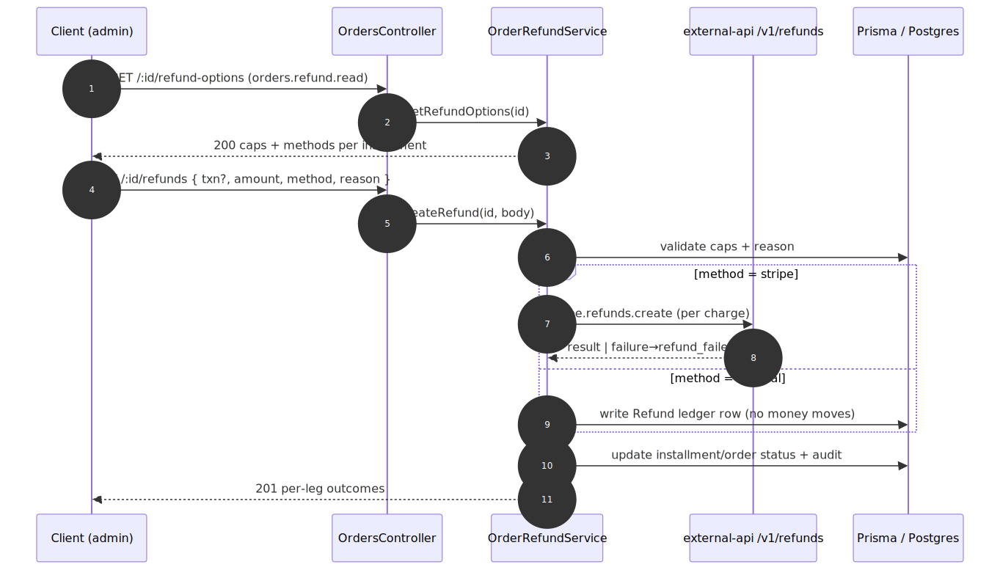

# Admin Refunds — contract

> Exact request/response contract for the **[Admin Refunds](../admin-refunds.md)** capability. Authoritative source: [`admin-backend-api/src/admin/orders/orders.controller.ts`](../../../admin-backend-api/src/admin/orders/orders.controller.ts) (`getRefundOptions`, `createRefund`), services [`services/order-refund.service.ts`](../../../admin-backend-api/src/admin/orders/services/order-refund.service.ts) + [`services/gift-certificate-restore.service.ts`](../../../admin-backend-api/src/admin/orders/services/gift-certificate-restore.service.ts) (SBE-1179), DTO `dto/order-refunds.dto.ts`; Stripe wrapper in `external-api-service`.

## Request flow

## Requests

| Method | Path | Permission | Params / Body |
|---|---|---|---|
| `GET` | `/api/v1/orders/:id/refund-options` | `orders.refund.read` | `id`. → `OrderRefundOptionsResponseDto`. |
| `POST` | `/api/v1/orders/:id/refunds` | `orders.refund` | Body `CreateOrderRefundDto`: `payment_transaction_id?` (omit = order-level, newest-first), `amount`, `method` (`stripe`\|`manual`), `reason` (mandatory), `send_notification?` (default true). → `OrderRefundResponseDto`. |
| `POST` | `external-api-service /v1/refunds` *(internal)* | — | `stripe.refunds.create` wrapper — one charge + amount per call, DB-free. |

## Response shapes

**`OrderRefundOptionsResponseDto`** — per settled installment (newest first): available `methods` (Manual always; Stripe only with a charge), `already_refunded` (pending + succeeded ledger), `remaining_cap`; plus order aggregates:

| Field | Type | Meaning |
|---|---|---|
| `paid_amount` | string (2-dp) | Gross paid. |
| `net_paid` | string | Gross − succeeded refunds. |
| `total_cap` | string | **Card** refund cap = Σ per-installment remaining caps (payment gateway only). |
| `gift_certificate_restorable` | string | **(SBE-1179)** Gift-certificate amount still restorable (Σ expense − Σ refund redeems); `0` when none applied. |
| `total_cap_with_gift_certificate` | string | **(SBE-1179)** `total_cap + gift_certificate_restorable`; a partial refund fills the card first (reverse priority), then the certificate. |
| `transactions` | `OrderRefundOptionDto[]` | Settled installments, newest first. |

**`OrderRefundResponseDto`** — per-leg outcomes in `refunds[]`: each targeted installment's refund status (`succeeded` / `refund_failed`), amount, method, and the ledger row id. An installment flips to `refunded` only when fully refunded; the order becomes `refunded` once every settled installment is. **(SBE-1179)** plus:

| Field | Type | Null | Meaning |
|---|---|---|---|
| `gift_certificate_restore` | `GiftCertificateRestoreDto` | yes | Set only when the refund spilled past the card cap and restored voucher balance (order-level, card-first); null/omitted otherwise. |
| ↳ `gift_certificate_purchase_id` | int | — | The voucher (GiftCertificatePurchase) restored. |
| ↳ `restored_amount` | string (2-dp) | — | Amount returned to the voucher. |
| ↳ `remaining_balance` | string (2-dp) | — | Voucher balance after the restore. |

## Status codes

| Code | When |
|---|---|
| `200` | Refund options retrieved. |
| `201` | Refund processed (per-leg outcomes returned; a Stripe leg may be recorded as a failed leg). |
| `400` | Missing amount/reason; amount exceeds the per-installment or order remaining cap (error quotes the exact `$` amount); Stripe unavailable (no charge — use Manual). |
| `403` | Missing `orders.refund.read` / `orders.refund`. |
| `404` | Unknown / soft-deleted / non-product order. |

---
*Regenerate diagram: `npx -y @mermaid-js/mermaid-cli mmdc -i admin-refunds.mmd -o admin-refunds.svg -b white -p ../../pptr.json`*
