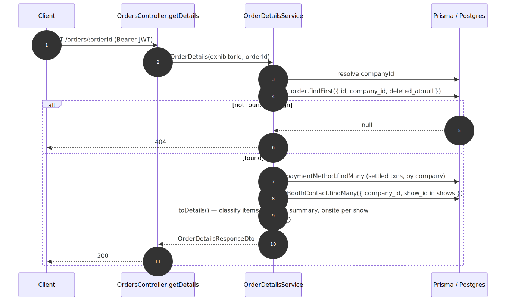

# Exhibitor Order Details — contract

> Exact request/response contract for the **[Exhibitor Order Details](../exhibitor-order-details.md)** capability. Authoritative source: [`exhibitor-backend-api/src/orders/orders.controller.ts`](../../../exhibitor-backend-api/src/orders/orders.controller.ts) (`getDetails`, `downloadInvoice`), services [`order-details.service.ts`](../../../exhibitor-backend-api/src/orders/order-details.service.ts) + [`order-invoice-document.service.ts`](../../../exhibitor-backend-api/src/orders/order-invoice-document.service.ts), DTOs [`dto/index.ts`](../../../exhibitor-backend-api/src/orders/dto/index.ts).

## Request flow

## Requests

| Method | Path | Auth | Path params | Body |
|---|---|---|---|---|
| `GET` | `/orders/:orderId` | `JwtAuthGuard` | `orderId` (`ParseIntPipe`) | — |
| `GET` | `/orders/:orderId/invoice` | `JwtAuthGuard` | `orderId` (`ParseIntPipe`) | — |

## Response — `OrderDetailsResponseDto` (`GET /orders/:orderId`)

| Field | Type | Null | Meaning |
|---|---|---|---|
| `id` | int | no | Order id. |
| `order_number` | string | no | Human-readable order number. |
| `order_date` | string (ISO) | no | When placed. |
| `status` | enum `OrderStatus` | no | Raw lifecycle status. |
| `payment_status` | `'paid_in_full'\|'partially_paid'\|'unpaid'` | no | Derived from paid_amount vs total. |
| `shows` | `OrderShowDto[]` | no | Grouped/deduped shows; `[]` for non-product. |
| `booths` | `OrderBoothDto[]` | no | Booth / workshop-pavilion lines (description, size, quantity, unit_price, subtotal). |
| `add_ons` | `OrderLineItemDto[]` | no | Add-on lines (description, quantity, unit_price, amount). |
| `sponsorships` | `OrderLineItemDto[]` | no | Sponsorship lines. |
| `financial_summary` | `FinancialSummaryDto` | no | Subtotal, coupon/gift-cert (mutually exclusive), fees, savings, total, total_paid, currency — conditional fields null when N/A. |
| `payments` | `PaymentRecordDto[]` | no | **Settled** payments only (method, paid_at, reference, amount); method sub-fields may be null. |
| `agreement` | `OrderAgreementDto` | yes | accepted / accepted_at / signer_name / terms_version — null when no agreement. |
| `onsite_contacts` | `OrderOnsiteContactDto[]` | no | One per show: `show_id`, `show_title`, `contact` (name/email/phone) or **null** when unset. `[]` for no-show orders. |
| `can_download_invoice` | boolean | no | Derived: product order with ≥1 issued invoice. |

## Response — `OrderInvoiceUrlResponseDto` (`GET /orders/:orderId/invoice`)

| Field | Type | Null | Meaning |
|---|---|---|---|
| `url` | string | no | URL to the generated invoice PDF for the client to open. |

## Status codes

| Code | When |
|---|---|
| `200` | Details / invoice URL returned. |
| `401` | Missing/invalid JWT. |
| `404` | Foreign or unknown order; invoice route also 404s for subscription/PPL or an order with **no** issued invoice yet. |

---
*Regenerate diagram: `npx -y @mermaid-js/mermaid-cli mmdc -i exhibitor-order-details.mmd -o exhibitor-order-details.svg -b white -p ../../pptr.json`*
