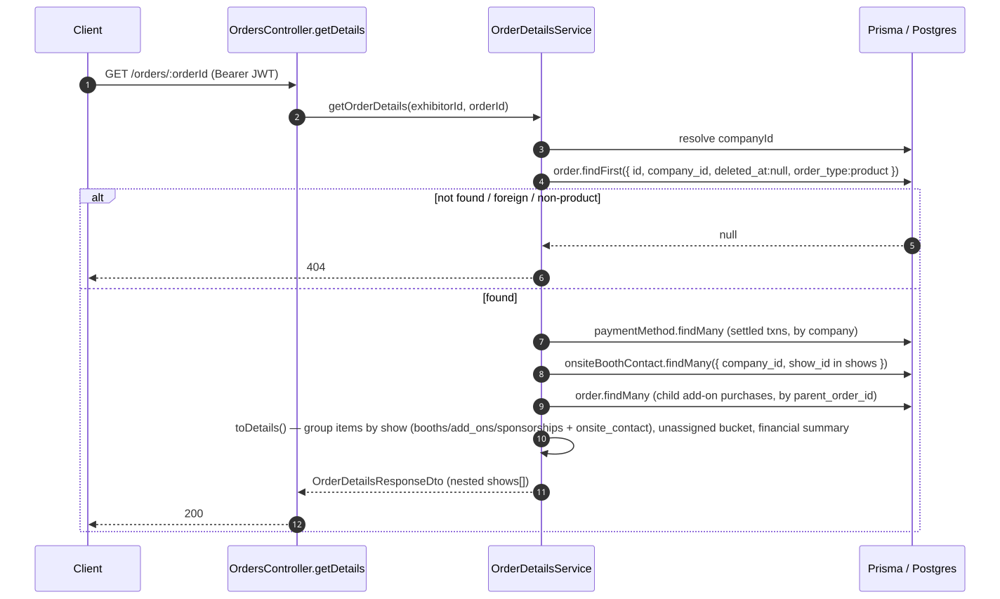

# Exhibitor Order Details — contract

> Exact request/response contract for the **[Exhibitor Order Details](../exhibitor-order-details.md)** capability. Authoritative source: [`exhibitor-backend-api/src/orders/orders.controller.ts`](../../../exhibitor-backend-api/src/orders/orders.controller.ts) (`getDetails`, `downloadInvoice`), services [`order-details.service.ts`](../../../exhibitor-backend-api/src/orders/order-details.service.ts) + [`order-invoice-document.service.ts`](../../../exhibitor-backend-api/src/orders/order-invoice-document.service.ts), DTOs [`dto/index.ts`](../../../exhibitor-backend-api/src/orders/dto/index.ts).

## Request flow

## Requests

| Method | Path | Auth | Path params | Body |
|---|---|---|---|---|
| `GET` | `/orders/:orderId` | `JwtAuthGuard` | `orderId` (`ParseIntPipe`) | — |
| `GET` | `/orders/:orderId/invoices` | `JwtAuthGuard` | `orderId` (`ParseIntPipe`) | — |
| `GET` | `/orders/invoices/:id` | `JwtAuthGuard` | `id` (`ParseIntPipe`, invoice id) | — |

> **Response-shape redesign (SBE-1147, 2026-07-26):** `GET /orders/:orderId` is now **product-gated** and **nested by show**. The former top-level `booths`/`add_ons`/`sponsorships`/`onsite_contacts` arrays no longer exist — each lives inside a `shows[]` entry. **Invoice rework (SBE-1146, 2026-07-17):** the old latest-only `GET /orders/:orderId/invoice` was replaced by `GET /orders/invoices/:id` (download by invoice id) + a new `GET /orders/:orderId/invoices` (list).

## Response — `OrderDetailsResponseDto` (`GET /orders/:orderId`)

| Field | Type | Null | Meaning |
|---|---|---|---|
| `id` | int | no | Order id. |
| `order_number` | string | no | Human-readable order number. |
| `order_date` | string (ISO) | no | When placed. |
| `status` | enum `OrderStatus` | no | Raw lifecycle status. |
| `payment_status` | `'paid_in_full'\|'partially_paid'\|'unpaid'` | no | Derived from paid_amount vs total. |
| `shows` | `OrderDetailShowDto[]` | no | **Nested by show.** Each entry: `id`, `title`, `city`, `date`, plus its own `booths`/`sponsorships`/`add_ons` and a single `onsite_contact`. `[]` for a checkout-born no-show order. |
| `shows[].booths` | `OrderBoothDto[]` | no | Booth / workshop-pavilion lines: `id`, `product_name` (live), `purchased_name` (snapshot), size, quantity, unit_price, `setup_fee`, `cleaning_fee`, subtotal (**inclusive** of fees + $0 inclusions). |
| `shows[].add_ons` | `OrderLineItemDto[]` | no | Add-on lines (`id`, `product_name`, `purchased_name`, quantity, unit_price, amount). |
| `shows[].sponsorships` | `OrderLineItemDto[]` | no | Sponsorship lines (same shape as add-ons). |
| `shows[].onsite_contact` | `OnsiteContactPersonDto` | yes | `{name,email,phone}` for that show, or **null** when unset (no billing fallback). |
| `unassigned` | `OrderUnassignedItemsDto` | yes | `{booths,sponsorships,add_ons}` for lines whose show could not be resolved; **null** when there are none. Surfaced (not dropped) so lines reconcile with the total. |
| `financial_summary` | `FinancialSummaryDto` | no | Subtotal, coupon/gift-cert (mutually exclusive), fees, savings, total, total_paid, currency — conditional fields null when N/A. Fees here are the **order** totals. |
| `payments` | `PaymentRecordDto[]` | no | **Settled** payments only (method, paid_at, reference, amount); method sub-fields may be null. |
| `agreement` | `OrderAgreementDto` | yes | accepted / accepted_at / signer_name / terms_version — null when no agreement. |
| `additional_purchases` | `AdditionalPurchaseDto[]` | no | Later add-on orders linked to this one (6.6); each carries `show:{id}` (`AdditionalPurchaseShowDto`, **nullable**) + flat `add_ons`. |
| `parent_order` | `{id, order_number}` | yes | Set when this order is itself an add-on purchase. |
| `can_download_invoice` | boolean | no | Derived: product order with ≥1 issued invoice. |

## Response — `OrderInvoiceListResponseDto` (`GET /orders/:orderId/invoices`)

| Field | Type | Null | Meaning |
|---|---|---|---|
| `invoices` | `OrderInvoiceListItemDto[]` | no | Newest first; `[]` when the order has no issued invoice yet. Each: `id`, `invoice_number`, `status`, `total`, `paid_at`, `created_at`. Pass a row `id` to `GET /orders/invoices/:id`. |

## Response — `OrderInvoiceUrlResponseDto` (`GET /orders/invoices/:id`)

| Field | Type | Null | Meaning |
|---|---|---|---|
| `url` | string | no | URL to the generated invoice PDF for the client to open. |

## Status codes

| Code | When |
|---|---|
| `200` | Details / invoice list / invoice URL returned (list is `200` with `[]` when no invoices yet). |
| `401` | Missing/invalid JWT. |
| `404` | Foreign or unknown order; **`GET /orders/:orderId` also 404s for a subscription/ppl_addon order (product gate)**; the invoice download 404s for a foreign/unknown/soft-deleted invoice or one not on a product order; the invoice list 404s for a foreign/unknown/non-product order. |

---
*Regenerate diagram: `npx -y @mermaid-js/mermaid-cli mmdc -i exhibitor-order-details.mmd -o exhibitor-order-details.svg -b white -p ../../pptr.json`*
