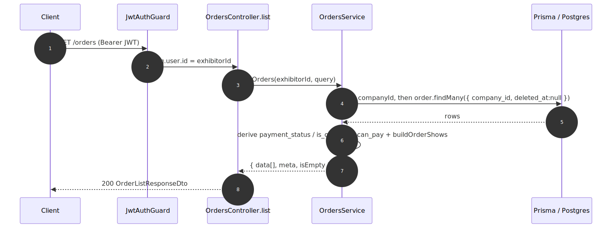

# Exhibitor Order Listing — contract

> Exact request/response contract for the **[Exhibitor Order Listing](../exhibitor-order-listing.md)** capability. The card has the mental model; this is the reference. Authoritative source: [`exhibitor-backend-api/src/orders/orders.controller.ts`](../../../exhibitor-backend-api/src/orders/orders.controller.ts) (`list`), service [`orders.service.ts`](../../../exhibitor-backend-api/src/orders/orders.service.ts), DTOs [`dto/index.ts`](../../../exhibitor-backend-api/src/orders/dto/index.ts).

## Request flow

## Requests

| Method | Path | Auth | Query params | Body |
|---|---|---|---|---|
| `GET` | `/orders` | `JwtAuthGuard` (exhibitor = `req.user.id`) | `page` (default 1), `limit` (default 10, ≤100), `search?` (≤100 chars, case-insensitive on order number) | — |

## Response — `OrderListResponseDto`

| Field | Type | Null | Meaning |
|---|---|---|---|
| `data` | `OrderListItemDto[]` | no | Orders for the current page. |
| `meta` | `PaginationMetaDto` | no | Pagination metadata (page/limit/total/…). |
| `isEmpty` | boolean | no | True when the exhibitor has **no** orders at all (drives the empty state). |

### `OrderListItemDto` (one row)

| Field | Type | Null | Meaning |
|---|---|---|---|
| `id` | int | no | Order id — target of the View action. |
| `order_number` | string | no | Human-readable order number. |
| `order_type` | enum `OrderType` | no | product \| subscription \| ppl_addon. |
| `order_date` | string (ISO) | no | When the order was placed. |
| `status` | enum `OrderStatus` | no | Raw lifecycle status (canceled/failed/refunded badges). |
| `payment_status` | `'paid_in_full'\|'partially_paid'\|'unpaid'` | no | Derived from paid_amount vs total. |
| `is_overdue` | boolean | no | Derived: any installment past due and still owing. |
| `total` | number | no | Order total (stored snapshot). |
| `currency` | string | no | ISO 4217 code. |
| `shows` | `OrderShowDto[]` | no | Grouped/deduped shows; `[]` for non-product orders. |
| `can_pay` | boolean | no | Derived: Pay action available (not paid-in-full, not canceled/refunded). |
| `can_download_invoice` | boolean | no | Derived: product order with ≥1 issued invoice. |

### `OrderShowDto`

| Field | Type | Null | Meaning |
|---|---|---|---|
| `id` | int | no | Show id (navigation target). |
| `title` | string | no | Show title. |
| `city` | string | yes | City name, or null when unset. |
| `date` | string (ISO) | yes | Event date, or null when TBA. |

## Status codes

| Code | When |
|---|---|
| `200` | Orders retrieved (including the empty-state case, `isEmpty: true`). |
| `401` | Missing/invalid JWT. |
| `400` | Invalid query (e.g. `limit` > 100, `search` > 100 chars). |

---
*Regenerate diagram: `npx -y @mermaid-js/mermaid-cli mmdc -i exhibitor-order-listing.mmd -o exhibitor-order-listing.svg -b white -p ../../pptr.json`*
