# Exhibitor Order Details

## What it does

The **read-only breakdown of one of the exhibitor's own orders** — everything the Order Details page needs in a single aggregate: header (order number, date, derived payment status, per-show list), **booth** lines (size, price, subtotal), **add-ons**, **sponsorships**, a conditional **financial summary** (subtotal, coupon *or* gift-certificate, fees, savings, totals), settled **payment records**, the **agreement** acceptance block, the per-show **onsite booth contacts**, and a `can_download_invoice` flag. A sibling route streams the **invoice PDF**. Ownership is enforced from the JWT — a foreign or unknown order id returns **404** (no enumeration leak). Backs story **13.3**.

## Its neighborhood

📋 **Need the exact contract?** → [Exhibitor Order Details contract](contract/exhibitor-order-details.md) (routes, params, response fields, status codes)

## Endpoints

| Method | Path | Purpose | Serves |
|---|---|---|---|
| `GET` | `/orders/:orderId` | The order-details aggregate (header, booths, add-ons, sponsorships, financial summary, settled payments, agreement, onsite contacts, `can_download_invoice`). | 13.3-a…ab |
| `GET` | `/orders/:orderId/invoice` | Generates/returns the order's **latest** persisted invoice PDF (Option B; product-only) and returns a URL to open it. | 13.3-s, 13.2-g |

## Flow, read as steps

1. `getOrderDetails(exhibitorId, orderId)` resolves the caller's **company id** from the exhibitor.
2. One scoped `order.findFirst({ where: { id, company_id, deleted_at: null }, select: ORDER_DETAILS_SELECT })` → **404** on null. No PII/billing/signature fields are selected.
3. `loadPaymentMethods` collects the distinct `stripe_payment_method_id` of **settled** (`succeeded`) transactions and does one `paymentMethod.findMany` scoped by company (no `deleted_at` filter, so a removed card still renders brand/last4) → a `Map`.
4. `resolveOnsiteContacts` runs `buildOrderShows` → one `onsiteBoothContact.findMany({ company_id, show_id: { in } })` → `buildOnsiteContacts` maps one entry per show, `contact: null` when unset (`[]` for no-show orders).
5. `toDetails` assembles the response: `classifyOrderItems` splits lines by `cart_item_type` into `booths`/`add_ons`/`sponsorships`; `buildFinancialSummary` sets conditional nulls; `payments[]` = settled only; `agreement` from the order's [OrderAgreement](../../relationship/2-entities/order-agreement.md).
6. The **invoice** route is separate: `OrderInvoiceDocumentService.generate(exhibitorId, orderId)` resolves the latest [Invoice](../../relationship/2-entities/invoice.md) and returns `{ url }` (404 for foreign/unknown/subscription/PPL/no-invoice).

## Why it matters / gotchas

- **No billing fallback for onsite contacts.** If a show has no saved contact, `contact` is `null` — it never falls back to the billing address (parity with the admin View Onsite Boot Contact read, SBE-1169).
- **`payments[]` are settled only.** It's payment *history*, not the schedule; the exhibitor side has no plan/installment machinery.
- **Deleted cards still render.** The payment-method lookup deliberately omits `deleted_at` so historical card brand/last4 survive.
- **Invoice is Option B and product-only.** It serves the latest *persisted* Invoice (which only exists after a successful payment) — not an on-the-fly render. Subscription/PPL orders 404.
- **Native reimplementation.** `buildOnsiteContacts`, `classifyOrderItems`, `buildOrderShows` here are copied *by semantics* from the admin side, never imported — the two servers share no code.

## Next

[Exhibitor Order Listing](exhibitor-order-listing.md) · [Admin Order Details](admin-order-details.md) · [the exhibitor story](../1-the-story/an-exhibitor-views-their-order.md)
