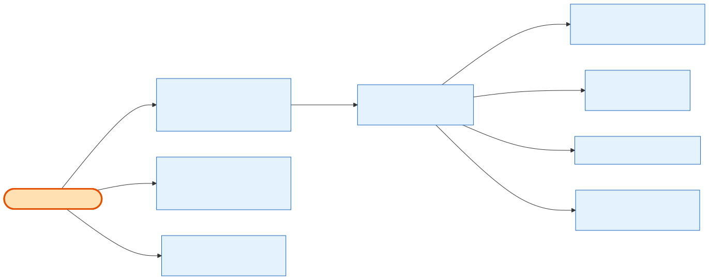

# Exhibitor Order Details

## What it does

The **read-only breakdown of one of the exhibitor's own orders** — everything the Order Details page needs in a single aggregate. Since **SBE-1147 (2026-07-26)** the body is **nested by show**: a `shows[]` list where each show carries its own **booth** lines (live `product_name` + snapshot `purchased_name`, size, price, per-booth `setup_fee`/`cleaning_fee`, subtotal), **add-ons**, **sponsorships**, and a single **onsite_contact** ({name,email,phone}|null). Alongside `shows[]`: a conditional **financial summary** (subtotal, coupon *or* gift-certificate, fees, savings, totals), settled **payment records**, the **agreement** acceptance block, **additional_purchases[]** (each tagged with its `show:{id}`), a `can_download_invoice` flag, and a nullable top-level **`unassigned`** bucket for any line whose show can't be resolved (surfaced, never dropped). Sibling routes **list** an order's invoices and stream a **specific invoice PDF** by id. The endpoint is **product-gated** — a subscription/ppl_addon order returns **404**, same as a foreign or unknown id (no enumeration leak). Ownership is enforced from the JWT. Backs story **13.3**.

## Its neighborhood

📋 **Need the exact contract?** → [Exhibitor Order Details contract](contract/exhibitor-order-details.md) (routes, params, response fields, status codes)

## Endpoints

| Method | Path | Purpose | Serves |
|---|---|---|---|
| `GET` | `/orders/:orderId` | The order-details aggregate, **nested by show** (`shows[]` → booths/add-ons/sponsorships/onsite_contact), plus financial summary, settled payments, agreement, `additional_purchases[]`, `unassigned`, `can_download_invoice`. **Product-gated** (subscription/ppl_addon → 404). | 13.3-a…ab |
| `GET` | `/orders/:orderId/invoices` | Lists every invoice on the order (newest first: `id`, `invoice_number`, `status`, `total`, `paid_at`, `created_at`); `[]` when none yet. Feeds ids to the download route. (SBE-1146) | 13.3-s |
| `GET` | `/orders/invoices/:id` | Generates/returns a **specific** persisted invoice PDF by id (Option B; product-only) and returns a URL to open it. Replaced the old latest-only `/orders/:orderId/invoice`. (SBE-1146) | 13.3-s, 13.2-g |

## Flow, read as steps

1. `getOrderDetails(exhibitorId, orderId)` resolves the caller's **company id** from the exhibitor.
2. One scoped `order.findFirst({ where: { id, company_id, deleted_at: null, order_type: product }, select: ORDER_DETAILS_SELECT })` → **404** on null. The `order_type: product` clause is the **product gate** (subscription/ppl_addon 404). No PII/billing/signature fields are selected.
3. `loadPaymentMethods` collects the distinct `stripe_payment_method_id` of **settled** (`succeeded`) transactions and does one `paymentMethod.findMany` scoped by company (no `deleted_at` filter, so a removed card still renders brand/last4) → a `Map`.
4. `resolveOnsiteContacts` runs `buildOrderShows` → one `onsiteBoothContact.findMany({ company_id, show_id: { in } })` → `buildOnsiteContacts` maps a `Map<show_id, contact>`, read per nested show (`null` when unset).
5. `toDetails` assembles the **nested** response: `groupClassifiedItemsByShow` buckets each line under its show (own `showProduct.show_id`, else one hop up `parent_order_item_id`), splitting by `cart_item_type` into per-show `booths`/`add_ons`/`sponsorships` with `product_name`/`purchased_name` and folded per-booth `setup_fee`/`cleaning_fee`; unresolvable-show lines land in the top-level **`unassigned`** bucket (logged). `buildFinancialSummary` sets conditional nulls; `payments[]` = settled only; `agreement` from the order's [OrderAgreement](../../relationship/2-entities/order-agreement.md); `loadAdditionalPurchases` returns child add-on orders each with `show:{id}`.
6. The **invoice** routes are separate: `listForOrder(exhibitorId, orderId)` returns the order's invoice rows newest-first; `generate(exhibitorId, invoiceId)` resolves that specific [Invoice](../../relationship/2-entities/invoice.md) and returns `{ url }` (404 for foreign/unknown/soft-deleted/non-product).

## Why it matters / gotchas

- **Nested by show, not flat (SBE-1147).** There are no top-level `booths`/`add_ons`/`sponsorships`/`onsite_contacts` arrays anymore — they live inside each `shows[]` entry. A FE reading the old flat shape breaks; this was a deliberate breaking change for the UI redesign.
- **`unassigned` catches orphans.** A line whose show can't be resolved (e.g. a purchased offering removed after the fact, `showProduct` SetNull) is surfaced in the nullable top-level `unassigned` bucket and logged — never silently dropped, so every visible line reconciles with the total. Cart-born product orders have zero unassignable lines in practice.
- **`purchased_name` is the snapshot; `product_name` is live.** `purchased_name` is the frozen name at purchase (the old `description`, renamed); `product_name` is the current `Product.name` (null if the product was SetNull-deleted). Don't treat them as interchangeable.
- **Booth `subtotal` is inclusive.** It already folds the per-booth `setup_fee`/`cleaning_fee` and any $0 default-included add-ons — don't re-add them when totalling.
- **Product-gated.** Subscription/ppl_addon orders 404 here (served by the PPL surface), matching the 13.2 listing and the invoice routes.
- **No billing fallback for onsite contacts.** If a show has no saved contact, `onsite_contact` is `null` — it never falls back to the billing address (parity with the admin View Onsite Boot Contact read, SBE-1169).
- **`payments[]` are settled only.** It's payment *history*, not the schedule; the exhibitor side has no plan/installment machinery.
- **Deleted cards still render.** The payment-method lookup deliberately omits `deleted_at` so historical card brand/last4 survive.
- **Invoice is Option B, per-invoice, product-only (SBE-1146).** The download serves a *specific persisted* Invoice by id (which only exists after a successful payment) — not an on-the-fly render, and no longer latest-only; the list route supplies the ids so split orders' older invoices are reachable. Subscription/PPL orders 404.
- **Native reimplementation.** `buildOnsiteContacts`, `classifyOrderItems`, `groupClassifiedItemsByShow`, `buildOrderShows` here are copied *by semantics* from the admin side, never imported — the two servers share no code.

## Next

[Exhibitor Order Listing](exhibitor-order-listing.md) · [Admin Order Details](admin-order-details.md) · [the exhibitor story](../1-the-story/an-exhibitor-views-their-order.md)
