# Exhibitor Order Listing

## What it does

The exhibitor's **order history table** — one paginated, **company-scoped** page of every order the logged-in exhibitor's company has placed, across all order types (`product`, `subscription`, `ppl_addon`), `pending` included. Each row is a display-ready summary: a derived **`payment_status`**, the grouped **[shows](../../relationship/2-entities/shows.md)** the order touches, `total`/`currency`, and per-row **action flags** (`can_pay`, `can_download_invoice`) so the frontend knows which buttons to show without a second call. Ownership is enforced server-side from the JWT — the client never passes a company id. This one endpoint backs both story **13.1 (Order History container)** and **13.2 (Order Listing Table)**.

## Its neighborhood

📋 **Need the exact contract?** → [Exhibitor Order Listing contract](contract/exhibitor-order-listing.md) (routes, params, response fields, status codes)

## Endpoints

| Method | Path | Purpose | Serves |
|---|---|---|---|
| `GET` | `/orders` | Paginated company-scoped listing: row fields + derived `payment_status`/`is_overdue` + grouped `shows[]` + `can_pay`/`can_download_invoice`. Optional `?search=` on order number. | 13.1-a…e, 13.2-a…m |

## Flow, read as steps

1. `JwtAuthGuard` attaches the exhibitor as `req.user.id`; `OrdersController.list` hands off to `OrdersService.listOrders(exhibitorId, query)`.
2. The service resolves the caller's **company id** server-side (from the exhibitor), then queries **[Order](../../relationship/2-entities/order.md)** with `where { company_id, deleted_at: null }` over the frozen `ORDER_LIST_SELECT` — no type/status narrowing, so subscriptions and `pending` orders appear too.
3. Pure helpers in `orders.helpers.ts` derive the display fields per row: `deriveOrderPaymentStatus` (paid_amount vs total), `deriveIsOverdue`, `deriveCanPay`, and `buildOrderShows` (distinct `showProduct.show` grouped into `shows[]`).
4. `can_download_invoice` = product order **and** at least one issued **[Invoice](../../relationship/2-entities/invoice.md)**.
5. Returns `{ data[], meta, isEmpty }` — `isEmpty` drives the empty-state UI.

## Why it matters / gotchas

- **Company scope is invisible in the path.** There is no `company_id` param — it comes from the token. A different exhibitor cannot widen the query.
- **`shows[]` is empty for non-product orders.** Subscriptions/PPL add-ons have no show linkage; the column renders blank, not an error.
- **`status` vs `payment_status`.** The raw lifecycle `status` drives canceled/failed/refunded badges; the derived `payment_status` drives the Payment Status column. Both ship on every row.
- **The View and Invoice actions reuse other endpoints.** Clicking a row's View navigates to [Exhibitor Order Details](exhibitor-order-details.md) (`GET /orders/:orderId`); the row's Invoice action hits the same invoice route as the details page — no listing-specific detail or invoice endpoint exists.

## Next

[Exhibitor Order Details](exhibitor-order-details.md) · [Admin Order List & Query](admin-order-list-and-query.md) · [the exhibitor story](../1-the-story/an-exhibitor-views-their-order.md)
