# Agreement

## What it is
A **versioned legal-terms template** (e.g. `booth_terms_of_use`, `ppl_terms_of_use`) that a [Product](product.md) can require a buyer to accept before purchase. It's the *master* terms document — distinct from the per-order signature, which is [OrderAgreement](order-agreement.md).

## Its neighborhood

📋 **Need the columns?** → [Agreement schema view](schema/agreement.md) (typed fields + data dictionary)

## Relationships, read as sentences
- An Agreement **is required by** many **[Products](product.md)** (1→N; the FK lives on Product as `agreement_id`, `SetNull`).
- When someone signs, the accepted terms are **captured as** an **[OrderAgreement](order-agreement.md)** — conceptually the "signed copy", though there is **no FK** between them (only a `terms_version` snapshot).

## Why it matters / gotchas
- **Template vs signature:** `Agreement` = the reusable terms; `OrderAgreement` = the immutable proof that one order accepted them. Don't conflate them.
- **Versioning by replacement:** when terms change, a *new* Agreement row is inserted and the old one soft-deleted (`deleted_at`); the Product's `agreement_id` is repointed. Historic OrderAgreements keep their original `terms_version`, so old signatures stay valid.

## Next
[OrderAgreement](order-agreement.md) · [Product](product.md)
