# CartItem

## What it is
**One line on a [Cart](cart.md)** — a booth, an add-on, or a fee. Add-on/sponsorship/fee lines nest *underneath* their booth line via a parent/child self-relation, so a booth and its extras stay grouped for the same show.

## Its neighborhood

## Relationships, read as sentences
- A CartItem **is a line of** one **[Cart](cart.md)** (N→1, cascade — delete the cart, the lines go).
- A CartItem **is of** one **[Product](product.md)** (N→1, `Restrict`) and usually **comes from** one **[ShowProduct](show-product.md)** (N→1, `Restrict`; null only for synthetic fee lines).
- A CartItem **may nest under** a parent CartItem (self-relation, cascade) — that's how add-ons sit under a booth.
- A CartItem **reserves stock through** many InventoryReservation rows (1→N).

## Why it matters / gotchas
- `show_product_id` is nullable **only** for synthetic fee lines (setup/cleaning fees); real product lines always have one.
- `is_default_included` marks a booth's bundled items — changing/removing them never changes totals.
- Prices are resolved into `unit_price` / `custom_unit_price` / `amount` snapshots on the line itself.

## Next
[Cart](cart.md) · [ShowProduct](show-product.md) · [OrderItem](order-item.md)
