# Cart

## What it is
A **mutable proposal/contract** a sales rep (or exhibitor) builds for a Company across one or more shows. It's the working draft of a deal. On signature it converts into exactly **one** [Order](order.md). Carts are the origin of *product* orders only (subscriptions/PPL add-ons don't use carts).

## Its neighborhood

📋 **Need the columns?** → [Cart schema view](schema/cart.md) (typed fields + data dictionary)

## Relationships, read as sentences
- A Cart **belongs to** one **[Company](company.md)** (N→1, cascade).
- A Cart **may have** an applied **[CouponCode](coupon-code.md)** (N→1, `SetNull`) and an assigned sales-rep **User** (`SetNull`).
- A Cart **contains** many **[CartItems](cart-item.md)** (1→N) and is **traced by** many **InventoryReservation** rows (1→N) — but those rows are written at *signature*, not while editing (see gotcha).
- A Cart **converts to** at most one **[Order](order.md)** (1→1).
- A Cart **may have** a parent Cart (self-relation, `SetNull`) — reserved for the deferred Booth-Build upsell.

## Why it matters / gotchas
- **A cart does NOT hold stock.** There is no add-to-cart hold — `InventoryReservation` rows are created only at *signature* (`ShowProduct.quantity − Σ(committed)` is availability). Many exhibitors can hold the same `ShowProduct` in their carts at once; it's **first-to-sign-wins, not first-to-add**. ("In my cart, so it's mine" is wrong here.)
- **One cart → one order**, enforced by a unique `cart_id` on the Order side. Conversion is a one-way door.
- `created_by` + `created_by_type` is a **polymorphic owner** (admin / sales / exhibitor) with **no FK** by design.
- Money fields here (`subtotal`, `discount`, `total_savings`, `coupon_amount`) are the live draft totals; at signature they're frozen onto the Order.
- Soft-delete only (`deleted_at`).

## Next
[CartItem](cart-item.md) · [Order](order.md) · [CouponCode](coupon-code.md)
