# CompanySubscription

## What it is
A **Company's live Pay-Per-Lead (PPL) subscription** — which plan they're on, their billing cycle, and their lead-credit usage/pacing. It's the hub of the *non-cart* order path: renewals create Orders directly, and it's what delivers Leads.

## Its neighborhood

## Relationships, read as sentences
- A CompanySubscription **belongs to** one **[Company](company.md)** (N→1, cascade).
- It **is on** one **SubscriptionPlan** (N→1, `Restrict` — a plan in use can't be deleted).
- It **is billed via** a **[PaymentMethod](payment-method.md)** (N→1, `SetNull`).
- It **renews via** many **[Orders](order.md)** (1→N, `SetNull`) and **delivers** many **Lead** rows (1→N).
- *Also linked to:* LeadTransactionLog, RetentionOfferRedemption, PPLCompanyAccountHistory.

## Why it matters / gotchas
- This is the **other origin of Orders** — subscription/renewal orders have `cart_id = null` and `company_subscription_id` set.
- Lots of state lives here: `lead_credits_allocated/used`, `rollover_credits`, daily/weekly pacing counters, and the Stripe subscription id. Pacing counters lazy-reset on read.
- `SubscriptionPlan` link has **no cascade** (defaults to `Restrict`) to protect plans that have active subscribers.

## Next
[Company](company.md) · [Order](order.md) · [PaymentMethod](payment-method.md)
