# Company

## What it is
The exhibitor **business** — the customer. It's the root of the commercial world: carts, orders, invoices, payments, saved cards, subscriptions, gift-certificate purchases and leads all belong to a Company. Delete a Company and that whole footprint cascades away with it.

## Its neighborhood

📋 **Need the columns?** → [Company schema view](schema/company.md) (typed fields + data dictionary)

## Relationships, read as sentences
- A Company **is logged into through** exactly one **[Exhibitor](exhibitor.md)** account (1→1).
- A Company **builds** many **[Carts](cart.md)** (1→N).
- A Company **places** many **[Orders](order.md)** (1→N).
- A Company **is billed via** many **[Invoices](invoice.md)** and **charged via** many **[PaymentTransactions](payment-transaction.md)** (1→N each).
- A Company **subscribes** through many **[CompanySubscriptions](company-subscription.md)** over time (1→N).
- A Company **saves** many **[PaymentMethods](payment-method.md)** (Stripe cards) (1→N).
- *Also linked to:* Lead, GiftCertificatePurchase, CompanyStripeAccount, CompanyIndustry/CompanyCategory, CompanyZipCode, PPLCompanyAccountHistory.

## Why it matters / gotchas
- **Almost everything cascades from Company** (`onDelete: Cascade`) — deleting one wipes its orders, invoices, payments, carts, subscriptions. In practice companies are not hard-deleted.
- `lead_balance` and `total_leads_purchased` on the row drive the Pay-Per-Lead program — they're counters, not separate tables.

## Next
[Exhibitor](exhibitor.md) · [Order](order.md) · [CompanySubscription](company-subscription.md)
