# CouponCode

## What it is
A **promo / discount** the platform issues (percentage off, fixed amount, free product, BOGO, free leads, bundle, or booth-fee waiver). It can be scoped to specific shows, products, and cities, and is applied to a [Cart](cart.md). This is what "discount" actually *is* in the schema — the `DiscountType` enum just says percentage vs fixed.

## Its neighborhood

📋 **Need the columns?** → [CouponCode schema view](schema/coupon-code.md) (typed fields + data dictionary)

## Relationships, read as sentences
- A CouponCode **is applied to** many **[Carts](cart.md)** (1→N, `SetNull` — removing a coupon doesn't delete the cart).
- A CouponCode **is scoped to** shows / products / cities via **CouponShows**, **CouponProducts**, **CouponCities** include/exclude rows (1→N each, cascade).
- A CouponCode **may grant** a reward **[Product](product.md)** (N→1, `SetNull`) for free-product/BOGO types.
- A CouponCode **is audited by** many **CouponAuditLog** rows (1→N) and **was created by** a **User** (`SetNull`).

## Why it matters / gotchas
- The discount **amount** doesn't live on the coupon at apply-time — it's mirrored onto `Cart.coupon_amount` / `Order.coupon_amount`.
- `code` is unique **case-insensitively, among non-deleted rows only** (partial index) — a soft-deleted code can be reused.
- Soft-delete only (`deleted_at`); `used_count` / `max_usage_count` enforce usage limits.

## Next
[Cart](cart.md) · [Shows](shows.md) · [Product](product.md)
