# Exhibitor

## What it is
The **login account** for a Company — the person who signs in, browses shows, and checks out. There is exactly **one Exhibitor per Company** (the `company_id` is unique). Think "Company = the business, Exhibitor = the user who represents it."

## Its neighborhood

## Relationships, read as sentences
- An Exhibitor **belongs to** exactly one **[Company](company.md)** (1→1, cascade).
- An Exhibitor **can invite** other Exhibitors (self-relation; `invited_by` is `SetNull` so removing the inviter doesn't delete invitees).
- An Exhibitor **may be assigned** a strategist and a referrer — both are **User** (admin/sales) records (`SetNull`).
- *Also linked to:* ExhibitorSession, ExhibitorToken, ContactMessage, NotificationLog, ExhibitorAuditLog (auth/audit internals).

## Why it matters / gotchas
- Because `company_id` is **unique**, you never have two Exhibitor logins for one Company in this model.
- The booth-buying flow is driven by the Company, not the Exhibitor — the Exhibitor is just the authenticated actor. Carts created by an exhibitor are stamped with `created_by_type = exhibitor` (a polymorphic owner, no FK).

## Next
[Company](company.md) · [Cart](cart.md)
