# GiftCertificate (+ Purchase + Redeem)

## What it is
A **gift-certificate** feature, modelled as **three** tables:
- **GiftCertificate** — the template (name, amount, validity).
- **GiftCertificatePurchase** — an instance a Company bought (has a `remaining_amount` and expiry).
- **GiftCertificateRedeem** — applying some of a purchase's balance to an Order.

## Its neighborhood

📋 **Need the columns?** → [GiftCertificate schema view](schema/gift-certificate.md) (typed fields + data dictionary)

## Relationships, read as sentences
- A GiftCertificate **is sold as** many **GiftCertificatePurchases** (1→N) and **is redeemed as** many **GiftCertificateRedeems** (1→N) — both `Restrict` (you can't delete a template that's been bought/used).
- A GiftCertificatePurchase **belongs to** a **[Company](company.md)** (N→1, cascade) and **is drawn down by** many redeems (1→N).
- A GiftCertificateRedeem **is applied to** one **[Order](order.md)** (N→1, **`Restrict`**) and also references the Company, the template, and the purchase.

## Why it matters / gotchas
- **`Restrict` on the Order link is why you can't delete an Order** that has a gift-certificate redemption against it.
- A redeem row carries a `type` (**SBE-1179**): `expense` (checkout draw-down) or `refund` (admin cancel/refund restore). Amounts are always positive; direction comes from `type`, not the sign.
- The redeem is **not** unique per order — an order has one `expense` row plus zero or more `refund` restorations (the old `@@unique([order_id])` was dropped). Balance tracking is via `remaining_amount` on both the purchase and each redeem.

## Next
[Order](order.md) · [Company](company.md)
