# Invoice

## What it is
The **billing document** for an [Order](order.md), with dual Stripe + QuickBooks sync. One order can produce **several** invoices (an initial one plus one per subscription renewal cycle), and an invoice can even arrive *before* its order exists.

## Its neighborhood

📋 **Need the columns?** → [Invoice schema view](schema/invoice.md) (typed fields + data dictionary)

## Relationships, read as sentences
- An Invoice **bills** at most one **[Order](order.md)** (N→1, `SetNull`; `order_id` is nullable).
- An Invoice **is billed to** one **[Company](company.md)** (N→1, cascade).
- An Invoice **is itemized by** many **InvoiceLineItem** rows (1→N, cascade); each line carries an `invoice_item_type` and may itself nest under a parent line (self-relation, `SetNull`).
- An Invoice **is settled by** many **[PaymentTransactions](payment-transaction.md)** (1→N, `SetNull`).

## Why it matters / gotchas
- **`order_id` is nullable on purpose:** Stripe subscription invoices may land before the Order row is created, so they're linked up afterwards.
- One Order → many Invoices (initial + renewals) — don't assume a 1:1.
- `stripe_invoice_id` is unique (webhook dedup); `quickbooks_*` fields track the second sync target. Soft-delete only.
- **InvoiceLineItem rows form a parent/child tree** (`parent_invoice_line_item_id`, self-relation `SetNull`) and tag each line with an `invoice_item_type` enum (`booth`, `addon`, `booth_setup_fee`, `subscription`, `ppl_addon`, …) — add-on/fee lines nest under their booth line, mirroring [OrderItem](order-item.md)/[CartItem](cart-item.md) nesting.

## Next
[Order](order.md) · [PaymentTransaction](payment-transaction.md) · [Company](company.md)
