# OnsiteBoothContact

## What it is
The exhibitor's **onsite point-of-contact for one specific booked show** — the person actually reachable at the booth during that show. It is deliberately **distinct from the venue/vendor contact** columns that live on [Shows](shows.md): those describe who runs the venue; this describes who the exhibitor is sending to stand at the booth. Set by the exhibitor during onboarding, one record per company per booked show.

## Its neighborhood

📋 **Need the columns?** → [OnsiteBoothContact schema view](schema/onsite-booth-contact.md) (typed fields + data dictionary)

## Relationships, read as sentences
- An OnsiteBoothContact **belongs to** exactly one **[Company](company.md)** (N→1, cascade) — delete the company and its onsite contacts go with it.
- An OnsiteBoothContact **belongs to** exactly one **[Shows](shows.md)** (N→1, cascade) — delete the show and its onsite contacts go with it.
- `(company_id, show_id)` is **unique** — there is **exactly one** onsite contact per company per show.

## Why it matters / gotchas
- It is a **Company × Show intersection table**: it lives off *both* parents and is **NOT a field on Shows**. Don't go looking for `onsite_contact_name` on the show row — the venue/vendor contact columns on Shows are a different thing entirely.
- The `(company_id, show_id)` unique key does double duty: it is also the **"apply to all shows" upsert key** — looping the same contact across every booked show is an upsert per show, not an insert.
- **Populated during Exhibitor Onboarding** (the Onsite Booth Contacts step); **later synced to HubSpot and pushed down to the order level** (separate stories).
- **Booked shows are derived**, not stored here: a show counts as "booked" when the company has a completed **product** order for it (Order `order_type='product'`, `status='completed'`).

## Next
[Shows](shows.md) · [Company](company.md) · [Company Micropage](company-micropage.md)
