# OrderItem

## What it is
A **frozen line on an [Order](order.md)** — a price/quantity snapshot taken at purchase time, so later catalog or price changes never rewrite order history. Each line points at exactly one of: a Product, a SubscriptionPlan, a PplAddonPackage, or a ShowProduct, depending on `item_type`.

## Its neighborhood

## Relationships, read as sentences
- An OrderItem **is a line of** one **[Order](order.md)** (N→1, cascade).
- When `item_type = product`, it **references** a **[Product](product.md)** and usually the **[ShowProduct](show-product.md)** it came from (both `SetNull`).
- When `item_type = subscription`, it **references** a **SubscriptionPlan** (`SetNull`).
- When `item_type = ppl_addon`, it **references** a **[PplAddonPackage](ppl-addon-package.md)** (`SetNull`).

## Why it matters / gotchas
- Exactly **one** of `product_id` / `subscription_plan_id` / `ppl_addon_package_id` is set per row — `item_type` is the discriminator.
- All catalog FKs are **`SetNull`**: deleting a product/plan/package never deletes order history, it just nulls the back-reference. The snapshot (`description`, `unit_price`, `amount`) survives.
- `lead_credits` carries PPL credits granted by subscription/add-on lines (0 for product lines).

## Next
[Order](order.md) · [Product](product.md) · [PplAddonPackage](ppl-addon-package.md)
