# Order

## What it is
A **confirmed purchase** — the transactional hub of the whole system. Everything that happens after "yes, I'll buy" hangs off the Order: the signed agreement, the frozen line items, the invoices, and the payments. An Order has two origins: **product orders** (born from a signed [Cart](cart.md)) and **subscription / ppl_addon orders** (born from the PPL side, no cart).

## Its neighborhood

## Relationships, read as sentences
- An Order **belongs to** exactly one **[Company](company.md)** (N→1, cascade).
- An Order **is born from** at most one **[Cart](cart.md)** (1→1, `SetNull`) — or none, for subscription orders.
- An Order **renews** a **[CompanySubscription](company-subscription.md)** when it's a subscription order (N→1, `SetNull`).
- An Order **contains** many **[OrderItems](order-item.md)** (1→N, cascade).
- An Order **is signed via** exactly one **[OrderAgreement](order-agreement.md)** (1→1, cascade) — immutable.
- An Order **is billed by** many **[Invoices](invoice.md)** (`SetNull`) and **paid by** many **[PaymentTransactions](payment-transaction.md)** (cascade).
- *Also linked to:* sales-person **User** (`Restrict`), InventoryReservation (`SetNull`), GiftCertificateRedeem (`Restrict`).

## Why it matters / gotchas
- `order_type` (`subscription` / `ppl_addon` / `product`) + whether `cart_id` is set tells you which origin path produced it.
- `payment_mode` = `full` (one PaymentTransaction) or `split` (N installments). `paid_amount` is bumped by webhooks until it equals `total`, then `paid_in_full_at` is set.
- You **cannot delete the sales User** on an order (`Restrict`), and you **cannot delete an order** that has a gift-certificate redemption (`Restrict`).
- Snapshots like `setup_fees`, `cleaning_fees`, `total_savings`, `coupon_amount` are frozen here — "total savings" is this column, not a table.
- Soft-delete only.

## Next
[OrderItem](order-item.md) · [OrderAgreement](order-agreement.md) · [Invoice](invoice.md) · [PaymentTransaction](payment-transaction.md)
