# PaymentTransaction

## What it is
**One charge against an [Order](order.md)** via Stripe — one installment of the payment. A full-payment order has exactly one row; a split-payment order has N rows (#1 charged at checkout, #2..N charged later by a background cron). It carries the whole Stripe PaymentIntent lifecycle plus retry/backoff state.

## Its neighborhood

📋 **Need the columns?** → [PaymentTransaction schema view](schema/payment-transaction.md) (typed fields + data dictionary)

## Relationships, read as sentences
- A PaymentTransaction **pays** one **[Order](order.md)** (N→1, cascade).
- It **is also linked to** the **[Company](company.md)** directly (N→1, cascade) — denormalized so the charging cron avoids a join.
- It **settles** at most one **[Invoice](invoice.md)** (N→1, `SetNull`), linked by webhook once the invoice exists.

## Why it matters / gotchas
- **Installments live here, not on the Order.** `installment_number` / `total_installments` describe the split; the Order just holds the running `paid_amount`.
- Idempotency is enforced by unique `stripe_payment_intent_id` and `idempotency_key`. The retry cron stops after `retry_count = 3`.
- Status transitions (`scheduled → succeeded / failed / refunded`) are owned by the Stripe webhook handler, not the app UI.

## Next
[Order](order.md) · [Invoice](invoice.md) · [PaymentMethod](payment-method.md)
