# PplAddonPackage

## What it is
A **buyable lead-credit top-up** — a one-time package like "20 leads for $25" on the Lead Top-ups tab. It's a small catalog table; this is the "lead add-on" sense of *add-on* (distinct from a booth add-on, which is a [Product](product.md)).

## Its neighborhood

## Relationships, read as sentences
- A PplAddonPackage **is purchased via** many **[OrderItems](order-item.md)** (1→N, `SetNull` on the item side).
- That's its only relation — it reaches an [Order](order.md) **only** through OrderItem (when `item_type = ppl_addon`).

## Why it matters / gotchas
- **Two kinds of "add-on" in this system:** a *booth* add-on is a `Product` (with an add-on [ProductType](product-type.md)); a *lead* add-on is this table. The term map in the [glossary](../glossary.md) spells this out.
- `(lead_credits, amount)` is unique. Has its own Stripe price/product ids for checkout.

## Next
[OrderItem](order-item.md) · [CompanySubscription](company-subscription.md)
