# ProductType

## What it is
The **category tree** that classifies Products. It's a self-referential hierarchy (a type can have a parent and children) with codes like `booth`, `workshop_pavilion`, sponsor tiers, and `booth_addons`. **This is the entity that tells a Booth apart from a Sponsorship apart from an Add-on** — they're all the same `Product` table, distinguished only by which ProductType they point at.

## Its neighborhood

📋 **Need the columns?** → [ProductType schema view](schema/product-type.md) (typed fields + data dictionary)

## Relationships, read as sentences
- A ProductType **may have** a parent ProductType and many child ProductTypes (self-relation, `Restrict` — you can't delete a type that still has children).
- A ProductType **types** many **[Products](product.md)** as their main type (1→N).
- A ProductType **also serves as** the add-on sub-type for many Products (the `booth_addon_type_id` link).

## Why it matters / gotchas
- **This is the #1 newcomer confusion-killer.** "Booth", "Pavilion", "Sponsorship", "Add-on" are *not* tables — they are ProductType rows. Always start from `Product` + its `product_type_id`.
- Everything is `Restrict` on delete to protect the hierarchy and any products hanging off a type.

## Next
[Product](product.md) · [the glossary term map](../glossary.md)
