# Product

## What it is
The **reusable catalog item** — a booth, workshop pavilion, sponsorship, or add-on. It defines *what* can be sold (name, dimensions, fee toggles, pricing model) **before** it's tied to any show. One Product can be offered at many shows.

## Its neighborhood

📋 **Need the columns?** → [Product schema view](schema/product.md) (typed fields + data dictionary)

## Relationships, read as sentences
- A Product **is typed as** one **[ProductType](product-type.md)** (N→1) — this is what makes it a booth vs pavilion vs sponsorship vs add-on.
- A Product **may require terms** from one **[Agreement](agreement.md)** before purchase (N→1, `SetNull`).
- A Product **is offered at shows as** many **[ShowProducts](show-product.md)** (1→N).
- A Product **is priced by** flat tiers (`ProductPriceTier`) or by booth-size (`ProductBoothSizePrice`) (1→N).
- A Product **is added to carts as** many **[CartItems](cart-item.md)** (`Restrict`) and **ordered as** many **[OrderItems](order-item.md)** (`SetNull`).
- A Product **may attach a dynamic question form** — a configurable questionnaire (the DynamicForm family) linked via `dynamic_question_form_id` (N→1, `SetNull`).

## Why it matters / gotchas
- **A Product is not purchasable on its own** — it must be attached to a [Shows](shows.md) via [ShowProduct](show-product.md) to get a price and stock.
- Booth dimensions/fees and "booth details" live as **columns here** (`length`, `width`, `booth_setup_fee_enabled`, `custom_amount`), not in a separate table.
- `price_type` is `flat` or `booth_size_based` — that decides which pricing table applies.
- The **DynamicForm family** (`DynamicForm` → `DynamicFormElement` → `Option`/`Validation`/`Condition`; submissions in `DynamicFormSubmission`/`DynamicFormSubmissionData`; enums `form_element_type`/`form_condition_action`/`form_submission_status`) is a **self-contained sub-system** — Product only references the form *head* via `dynamic_question_form_id`.

## Next
[ProductType](product-type.md) · [ShowProduct](show-product.md) · [Agreement](agreement.md)
