# Agreement — schema view

> Detailed schema for the **[Agreement](../agreement.md)** entity. The card has the mental model; this is the column-level reference. Authoritative source: [`schema.prisma:314`](../../../admin-backend-api/prisma/schema.prisma#L314) (`admin-backend-api` — source of truth).

## Diagram (entity + typed columns + relations)

*Relation labels carry cardinality and `onDelete`. Crow's-foot notation: `||`=exactly one, `o{`=zero-or-many, `o|`=zero-or-one.*

## Data dictionary
| Column | Type | Key | Null | Meaning |
|---|---|---|---|---|
| `id` | int | PK | no | Surrogate key |
| `type` | enum `AgreementType` | — | no | `ppl_terms_of_use` \| `booth_terms_of_use` |
| `title` | varchar(150) | — | no | Display title |
| `description` | varchar(500) | — | yes | Short description |
| `content` | text | — | yes | Terms body (inline) |
| `version` | varchar(50) | — | yes | Version label |
| `language` | varchar(10) | — | no | Default `en` |
| `is_active` | boolean | — | no | Default true |
| `is_default` | boolean | — | no | Default false |
| `file_url` | varchar(500) | — | yes | Uploaded terms document URL |
| `file_name` | varchar(255) | — | yes | Original file name |
| `mime_type` | varchar(100) | — | yes | File MIME type |
| `file_last_updated_on` | timestamptz | — | yes | When the file was last updated |
| `deleted_at` | timestamptz | — | yes | **Soft delete only** |
| `created_at` / `updated_at` | timestamptz | — | no | Timestamps |

## Relations
| Related entity | Cardinality | onDelete | Meaning |
|---|---|---|---|
| [Product](../product.md) | 1→N | SetNull | Products requiring these terms (FK `agreement_id` lives on Product) |

*The per-order signature ([OrderAgreement](../order-agreement.md)) is **not** an FK relation — it only carries a `terms_version` value snapshot, so re-versioning never alters historic signatures.*

## Indexes
`(type, is_active)`, `(type, is_default)`, `(type, deleted_at)`, `deleted_at` — no unique constraints.

---
*Regenerate diagram: `mmdc -i agreement.mmd -o agreement.svg -b white -p pptr.json -c mermaid-config.json`*
