# CartItem — schema view

> Detailed schema for the **[CartItem](../cart-item.md)** entity. The card has the mental model; this is the column-level reference. Authoritative source: [`schema.prisma:2680`](../../../admin-backend-api/prisma/schema.prisma#L2680) (`admin-backend-api` — source of truth).

## Diagram (entity + typed columns + relations)

*Relation labels carry cardinality and `onDelete`. Crow's-foot notation: `||`=exactly one, `o{`=zero-or-many, `o|`=zero-or-one.*

## Data dictionary
| Column | Type | Key | Null | Meaning |
|---|---|---|---|---|
| `id` | int | PK | no | Surrogate key |
| `cart_id` | int | FK→Cart | no | Owning cart (cascade) |
| `product_id` | int | FK→Product | no | Product on this line (restrict) |
| `show_product_id` | int | FK→ShowProduct | yes | Per-show offer; **null only for synthetic fee lines** (restrict) |
| `parent_cart_item_id` | int | FK→CartItem (self) | yes | Add-on/sponsorship/fee nested under a booth line for the same show (cascade) |
| `item_type` | enum `CartItemType` | — | no | `booth` \| `workshop_pavilion` \| `sponsorship` \| `addon` \| `booth_setup_fee` \| `booth_cleaning_fee` |
| `is_default_included` | boolean | — | no | Booth's bundled items; decreasing/removing never changes totals; default `false` |
| `quantity` | int | — | no | Default 1 |
| `unit_price` | decimal(10,2) | — | no | Resolved per-unit price |
| `custom_unit_price` | decimal(10,2) | — | yes | Manual override (takes precedence) |
| `amount` | decimal(10,2) | — | no | `round(coalesce(custom_unit_price, unit_price) × quantity, 2)` |
| `description` | varchar(255) | — | no | Snapshot of item name |
| `metadata` | jsonb | — | yes | Free-form snapshot (booth size, show title, fee scope, etc.) |
| `created_at` / `updated_at` | timestamptz | — | no | Timestamps |

## Relations
| Related entity | Cardinality | onDelete | Meaning |
|---|---|---|---|
| [Cart](../cart.md) | N→1 | Cascade | Owning cart |
| [Product](../product.md) | N→1 | Restrict | Product on the line |
| [ShowProduct](../show-product.md) | N→1 (opt) | Restrict | Per-show offer (null for fee lines) |
| [CartItem](../cart-item.md) (self, parentItem) | N→1 (opt) | Cascade | Parent booth line — add-ons nest under it |
| InventoryReservation | 1→N | — | Stock ledger (written at signature for traceability) |

## Indexes
`cart_id`, `show_product_id`, `product_id`, `parent_cart_item_id`.

---
*Regenerate diagram: `mmdc -i cart-item.mmd -o cart-item.svg -b white -p pptr.json -c mermaid-config.json`*
