# Cart — schema view

> Detailed schema for the **[Cart](../cart.md)** entity. The card has the mental model; this is the column-level reference. Authoritative source: [`schema.prisma:2625`](../../../admin-backend-api/prisma/schema.prisma#L2625) (`admin-backend-api` — source of truth).

## Diagram (entity + typed columns + relations)

*Relation labels carry cardinality and `onDelete`. Crow's-foot notation: `||`=exactly one, `o{`=zero-or-many, `o|`=zero-or-one.*

## Data dictionary
| Column | Type | Key | Null | Meaning |
|---|---|---|---|---|
| `id` | int | PK | no | Surrogate key |
| `cart_number` | varchar(50) | UK | no | Human-readable ref (e.g. `CART-2026-00001`) |
| `company_id` | int | FK→Company | no | Owning company (cascade) |
| `created_by` | int | — | no | **Polymorphic** owner id → `users` (admin/sales) or `exhibitors`; **NO FK by design** (see `created_by_type`) |
| `created_by_type` | enum `CartOwnerType` | — | no | Discriminator for `created_by`: `admin` \| `sales` \| `exhibitor` |
| `parent_cart_id` | int | FK→Cart (self) | yes | Booth-Build / upsell child → main contract; deferred placeholder (setNull) |
| `coupon_code_id` | int | FK→CouponCode | yes | Applied coupon; null = none (setNull) |
| `stage` | enum `CartStage` | — | no | `proposal` \| `contract`; default `contract` |
| `status` | enum `CartStatus` | — | no | `draft` \| `shared_not_signed` \| `signed` \| `expired` \| `voided`; default `draft` |
| `previous_status` | enum `CartStatus` | — | yes | Active status held before `expired`; restored on reactivation |
| `currency` | varchar(10) | — | no | Default `usd` |
| `client_first_name` … `client_email` | varchar(255) | — | yes | **3-field** customer contact for share/sign |
| `subtotal` | decimal(10,2) | — | no | Σ product line amounts (excludes fees); default 0 |
| `setup_fees` | decimal(10,2) | — | no | Σ per-show booth setup fees; default 0 |
| `cleaning_fees` | decimal(10,2) | — | no | Σ per-show booth cleaning fees; default 0 |
| `discount` | decimal(10,2) | — | no | Coupon discount applied to subtotal; default 0 |
| `tax` | decimal(10,2) | — | no | Default 0 (no tax rule yet; pluggable) |
| `total` | decimal(10,2) | — | no | `max(0, subtotal + fees − discount + tax)`; default 0 |
| `total_savings` | decimal(10,2) | — | no | Σ (actual − sales) × qty, never negative; default 0 |
| `coupon_amount` | decimal(10,2) | — | no | Mirror of `discount` for order snapshot; default 0 |
| `expiration_date` | timestamptz | — | yes | Business expiry; reached → status `expired` |
| `idempotency_key` | varchar(255) | UK | yes | De-dupes create-cart retries |
| `assigned_sales_rep_id` | int | FK→User | yes | Responsible sales rep; only active sales user assignable (setNull) |
| `shared_version` | int | — | no | Bumped on every confirmed edit of a shared cart; invalidates prior snapshot; default 0 |
| `special_notes` | text | — | yes | Special Notes to Client — customer-visible |
| `internal_notes` | text | — | yes | Internal Notes for Client Services — CS-only |
| `invoice_note` | varchar(255) | — | yes | Invoice Note / PO Number |
| `additional_terms` | text | — | yes | Additional Terms & Conditions |
| `deleted_at` | timestamptz | — | yes | **Soft delete only** |
| `created_at` / `updated_at` | timestamptz | — | no | Timestamps |

## Relations
| Related entity | Cardinality | onDelete | Meaning |
|---|---|---|---|
| [Company](../company.md) | N→1 | Cascade | Owner |
| [CouponCode](../coupon-code.md) | N→1 (opt) | SetNull | Applied coupon |
| [User](../exhibitor.md) (assignedSalesRep) | N→1 (opt) | SetNull | Responsible sales rep |
| [Cart](../cart.md) (self, parentCart) | N→1 (opt) | SetNull | Parent cart — Booth-Build upsell (deferred) |
| [CartItem](../cart-item.md) | 1→N | — | Cart lines |
| InventoryReservation | 1→N | — | Stock ledger (written at signature, not while editing) |
| [Order](../order.md) | 1→1 (opt) | — | Converts to exactly one order (unique `cart_id` on Order side) |

*`created_by` + `created_by_type` is a polymorphic owner (users / exhibitors) with no FK by design.*

## Indexes
`company_id`, `status`, `stage`, `(created_by_type, created_by)`, `expiration_date`, `parent_cart_id`, `assigned_sales_rep_id` — plus unique on `cart_number`, `idempotency_key`.

---
*Regenerate diagram: `mmdc -i cart.mmd -o cart.svg -b white -p pptr.json -c mermaid-config.json`*
