# Company Micropage (CMS profile) — schema view

> Detailed schema for the **[Company Micropage](../company-micropage.md)**. The card has the mental model; this is the column-level reference. The micropage is **not one table** — its repeating sections are two child tables, and its scalar content lives on the Company row. Authoritative source (`admin-backend-api` — source of truth): `CompanyService` [`schema.prisma:918`](../../../admin-backend-api/prisma/schema.prisma#L918), `CompanyTestimonialVideo` [`schema.prisma:934`](../../../admin-backend-api/prisma/schema.prisma#L934). The scalar micropage fields live on **Company** — see [Company schema view](company.md) at [`schema.prisma:804`](../../../admin-backend-api/prisma/schema.prisma#L804).

## Diagram (entities + typed columns + relations)

*Relation labels carry cardinality and `onDelete`. Crow's-foot notation: `||`=exactly one, `o{`=zero-or-many, `o|`=zero-or-one.*

## Data dictionary

### CompanyService (`company_services`, [L918](../../../admin-backend-api/prisma/schema.prisma#L918))
Services a company offers, listed (ordered) on its CMS micropage.

| Column | Type | Key | Null | Meaning |
|---|---|---|---|---|
| `id` | int | PK | no | Surrogate key |
| `company_id` | int | FK→[Company](company.md) | no | Owning company (cascade) |
| `title` | varchar(255) | — | no | Service title |
| `description` | text | — | no | Service description |
| `display_order` | int | — | no | Sort order; default `0` |
| `created_at` / `updated_at` | timestamptz | — | no | Timestamps |

### CompanyTestimonialVideo (`company_testimonial_videos`, [L934](../../../admin-backend-api/prisma/schema.prisma#L934))
Testimonial videos shown (ordered) on the CMS micropage.

| Column | Type | Key | Null | Meaning |
|---|---|---|---|---|
| `id` | int | PK | no | Surrogate key |
| `company_id` | int | FK→[Company](company.md) | no | Owning company (cascade) |
| `title` | varchar(255) | — | yes | Optional video title |
| `video_url` | varchar(255) | — | no | Video URL |
| `thumbnail_url` | varchar(255) | — | yes | Optional poster/thumbnail URL |
| `display_order` | int | — | no | Sort order; default `0` |
| `created_at` / `updated_at` | timestamptz | — | no | Timestamps |

### Company scalar micropage columns (on the `companies` row, [L804](../../../admin-backend-api/prisma/schema.prisma#L804))
These are columns on **Company**, not separate tables — see [Company schema view](company.md):
- `cover_image` — varchar(255), nullable. Cover/hero image; NULL ⇒ CMS shows a default generic image.
- `company_video_url` — varchar(255), nullable. Single promo/intro video.
- `offer_title` / `offer_description` — varchar(255) / text, nullable. The single attendee offer.
- `offer_discount_percent` — decimal(5,2), nullable. Discount % (0-100).
- `offer_link` — varchar(255), nullable. Link to the offer page.
- `medallion_certification_number` — varchar(50), **UNIQUE**, nullable. Auto-generated cert number embedded in the medallion.
- `medallion_url` — varchar(255), nullable. Generated medallion image URL (downloadable + shown on the page).
- `medallion_generated_at` — timestamptz, nullable. When the medallion/cert was issued.
- `profile_completed_at` — timestamptz, nullable. Marks the profile step done; drives the "Step 2 of 3" progress indicator.

## Relations
| From → To | Cardinality | onDelete | Meaning |
|---|---|---|---|
| CompanyService → [Company](company.md) | N→1 | Cascade | Owning company; service rows die with the company |
| CompanyTestimonialVideo → [Company](company.md) | N→1 | Cascade | Owning company; video rows die with the company |

## Indexes
CompanyService: `@@index([company_id])`. CompanyTestimonialVideo: `@@index([company_id])`. The micropage's only uniqueness is the column-level `@unique` on `Company.medallion_certification_number` (one globally-unique cert number per company).

---
*Regenerate diagram: `mmdc -i company-micropage.mmd -o company-micropage.svg -b white -p pptr.json -c mermaid-config.json`*
