# CompanySubscription — schema view

> Detailed schema for the **[CompanySubscription](../company-subscription.md)** entity. The card has the mental model; this is the column-level reference. Authoritative source: [`schema.prisma:613`](../../../admin-backend-api/prisma/schema.prisma#L613) (`admin-backend-api` — source of truth).

## Diagram (entity + typed columns + relations)

*Relation labels carry cardinality and `onDelete`. Crow's-foot notation: `||`=exactly one, `o{`=zero-or-many, `o|`=zero-or-one.*

## Data dictionary
| Column | Type | Key | Null | Meaning |
|---|---|---|---|---|
| `id` | int | PK | no | Surrogate key |
| `company_id` | int | FK→[Company](company.md) | no | Owning company (cascade) |
| `subscription_plan_id` | int | FK→SubscriptionPlan | no | Plan; **restrict** (default — can't delete plan in use) |
| `payment_method_id` | int | FK→[PaymentMethod](payment-method.md) | yes | Mirrors Stripe `default_payment_method` (setNull) |
| `stripe_subscription_id` | varchar(255) | UK | yes | Stripe subscription id (null while incomplete); webhook lookup |
| `stripe_customer_id` | varchar(255) | — | yes | Stripe customer (null while incomplete) |
| `status` | enum `SubscriptionStatus` | — | no | `active` \| `paused` \| `past_due` \| `canceled` \| `incomplete` \| `trialing` \| `unpaid`; default `active` |
| `billing_frequency` | enum `BillingFrequency` | — | no | `monthly` \| `yearly`; default `monthly` |
| `subscription_amount` | decimal(10,2) | — | yes | List price before yearly discount (PAYG = budget; fixed monthly = plan.amount; fixed yearly = ×12) |
| `total_amount` | decimal(10,2) | — | yes | What they pay today (yearly applies discount) |
| `price_per_lead_locked` | decimal(10,2) | — | yes | Snapshot of `plan.price_per_lead`; **PAYG only**, NULL for fixed |
| `lead_credits_allocated` | int | — | no | Credits given this cycle; default 0 |
| `lead_credits_used` | int | — | no | Credits consumed this cycle; default 0 |
| `rollover_credits` | int | — | no | Unused credits carried from prior cycles; default 0 |
| `total_credits_granted` | int | — | no | Lifetime credits granted across cycles; default 0 |
| `current_period_start` | timestamptz | — | yes | Billing-cycle start |
| `current_period_end` | timestamptz | — | yes | Billing-cycle end |
| `cancel_at_period_end` | boolean | — | no | Scheduled cancel flag; default false |
| `canceled_at` | timestamptz | — | yes | When actually canceled |
| `cancellation_reason` | text | — | yes | Provider free-text (My Plan → Cancel); NULL for other routes |
| `paused_at` | timestamptz | — | yes | When paused |
| `resumed_at` | timestamptz | — | yes | When last resumed |
| `daily_leads_delivered` | int | — | no | PPL pacing counter; lazy-reset after `daily_reset_at`; default 0 |
| `weekly_leads_delivered` | int | — | no | PPL pacing counter; lazy-reset + rollover by task; default 0 |
| `daily_reset_at` | timestamptz | — | yes | When daily pacing counter last reset |
| `weekly_reset_at` | timestamptz | — | yes | When weekly pacing counter last reset |
| `created_at` / `updated_at` | timestamptz | — | no | Timestamps |

## Relations
| Related entity | Cardinality | onDelete | Meaning |
|---|---|---|---|
| [Company](company.md) | N→1 | Cascade | Owner |
| SubscriptionPlan | N→1 | Restrict (implicit) | Plan subscribed to |
| [PaymentMethod](payment-method.md) | N→1 (opt) | SetNull | Default billing card |
| [Order](order.md) | 1→N | — | Renewal/subscription orders |
| Lead | 1→N | SetNull (from lead) | Leads distributed under this subscription |
| RetentionOfferRedemption | 1→N | Cascade | Retention-offer decisions |
| PPLCompanyAccountHistory | 1→N | — | PPL account-history entries |

## Indexes
`company_id`, `subscription_plan_id`, `status`, `payment_method_id` — plus unique on `stripe_subscription_id`.

---
*Regenerate diagram: `mmdc -i company-subscription.mmd -o company-subscription.svg -b white -p pptr.json -c mermaid-config.json`*
