# Company — schema view

> Detailed schema for the **[Company](../company.md)** entity. The card has the mental model; this is the column-level reference. Authoritative source: [`schema.prisma:779`](../../../admin-backend-api/prisma/schema.prisma#L779) (`admin-backend-api` — source of truth).

## Diagram (entity + typed columns + relations)

*Relation labels carry cardinality and `onDelete`. Crow's-foot notation: `||`=exactly one, `o{`=zero-or-many, `o|`=zero-or-one.*

## Data dictionary
| Column | Type | Key | Null | Meaning |
|---|---|---|---|---|
| `id` | int | PK | no | Surrogate key |
| `name` | varchar(255) | — | no | Company legal name |
| `company_print_name` | varchar(255) | — | no | Name as printed on documents |
| `address_line_1` | varchar(255) | — | no | Street address line 1 |
| `address_line_2` | varchar(255) | — | yes | Street address line 2 |
| `city` | varchar(255) | — | no | City |
| `state` | varchar(255) | — | no | State |
| `country` | varchar(255) | — | no | Country |
| `zip_code` | varchar(20) | — | no | Postal code |
| `latitude` | decimal(9,6) | — | yes | Geo latitude |
| `longitude` | decimal(9,6) | — | yes | Geo longitude |
| `company_bio` | text | — | yes | Free-form bio |
| `company_logo` | varchar(255) | — | yes | Logo path/URL |
| `company_website` | varchar(255) | — | yes | Website URL |
| `company_twitter` … `company_tiktok` | varchar(255) | — | yes | **7-field** social links (twitter, linkedin, instagram, facebook, youtube, tiktok) |
| `hubspot_company_id` | varchar(50) | — | yes | HubSpot CRM id |
| `admin_account_history_note` | text | — | yes | Admin-side account note |
| `status` | boolean | — | no | Active flag; default `true` |
| `lead_balance` | int | — | no | Running total of available PPL lead credits; default 0 |
| `low_balance_notified_at` | timestamptz | — | yes | Set when Low Balance email sent; cleared when balance recovers (dedupe) |
| `total_leads_purchased` | int | — | no | Lifetime count of leads accepted/claimed; default 0 |
| `lead_email_preference` | enum `LeadEmailPreference` | — | no | `instant` \| `daily_summary` \| `none`; default `instant` |
| `service_area_type` | enum `ServiceAreaType` | — | no | `national` (country-wide) \| `local` (specific zips); default `local` |
| `created_at` / `updated_at` | timestamptz | — | no | Timestamps |

## Relations
| Related entity | Cardinality | onDelete | Meaning |
|---|---|---|---|
| [Exhibitor](../exhibitor.md) | 1→1 (opt) | Cascade | The login user that owns this company |
| [CompanySubscription](../company-subscription.md) | 1→N | Cascade | Subscription history |
| [PaymentMethod](../payment-method.md) | 1→N | Cascade | Saved Stripe cards |
| [Order](../order.md) | 1→N | Cascade | Purchases placed |
| [Invoice](../invoice.md) | 1→N | Cascade | Billing documents |
| [Cart](../cart.md) | 1→N | Cascade | Shopping carts |
| [PaymentTransaction](../payment-transaction.md) | 1→N | Cascade | Charges |
| [GiftCertificate](../gift-certificate.md) | 1→N | Cascade | Purchases + redemptions |
| Lead | 1→N | Cascade | Leads received (PPL) |
| LeadTransactionLog | 1→N | Cascade | Lead credit ledger |
| CompanyIndustry / CompanyCategory | 1→N | Cascade | Industry/category mappings |
| CompanyStripeAccount / CompanyZipCode | 1→N | Cascade | Stripe accounts, service zips |

*Also linked (supporting): `CategoryCompanyLog`, `CompanyLeadEmail`, `PaygMonthlySpend`, `RetentionOfferRedemption`, `PPLCompanyAccountHistory`.*

## Indexes
Primary key on `id`. (No additional `@@index` / `@@unique` declared on the model — uniqueness lives on the child side, e.g. `Exhibitor.company_id` is `@unique`.)

---
*Regenerate diagram: `mmdc -i company.mmd -o company.svg -b white -p pptr.json -c mermaid-config.json`*
