# CouponCode — schema view

> Detailed schema for the **[CouponCode](../coupon-code.md)** entity. The card has the mental model; this is the column-level reference. Authoritative source: [`schema.prisma:1662`](../../../admin-backend-api/prisma/schema.prisma#L1662) (`admin-backend-api` — source of truth).

## Diagram (entity + typed columns + relations)

*Relation labels carry cardinality and `onDelete`. Crow's-foot notation: `||`=exactly one, `o{`=zero-or-many, `o|`=zero-or-one.*

## Data dictionary
| Column | Type | Key | Null | Meaning |
|---|---|---|---|---|
| `id` | int | PK | no | Surrogate key |
| `code` | varchar(100) | — | no | Code entered by user (e.g. "SAVE20"); unique case-insensitively among non-deleted rows (partial index) |
| `description` | text | — | yes | Free-form |
| `coupon_type` | enum `CouponType` | — | no | `percentage_discount` \| `fixed_discount` \| `free_product` \| `buy_one_get_one` \| `free_ppl_leads` \| `bundle_of_products` \| `booth_free_ppl_lead` |
| `applicability` | enum `CouponApplicability`[] | — | no | Array; `self_service` \| `salesman`; default `[]` |
| `discount_value` | decimal(10,2) | — | yes | e.g. 20.00 for 20% or $20 |
| `valid_from` | timestamptz | — | yes | Start of validity window |
| `valid_until` | timestamptz | — | yes | End of validity window |
| `usage_limit_type` | enum `CouponUsageLimitType` | — | yes | `limited` \| `unlimited` |
| `used_count` | int | — | no | How many times used; default 0 |
| `max_usage_count` | int | — | yes | Max uses; positive int when `usage_limit_type = limited` |
| `can_be_used_once_per_company` | boolean | — | no | Default false |
| `reward_product_id` | int | FK→Product | yes | Reward product (setNull) |
| `reward_product_quantity` | int | — | yes | Reward product quantity |
| `reward_product_type` | enum `RewardProductType` | — | yes | `free` \| `discounted` |
| `reward_lead_count` | int | — | yes | Reward lead count (free PPL leads) |
| `is_booth_setup_and_cleaning_fees_waived` | boolean | — | no | Waives booth setup + cleaning fees; default false |
| `created_by` | int | FK→User | yes | Issuing user (setNull) |
| `status` | enum `CouponStatus` | — | no | `active` \| `inactive` \| `expired` \| `draft`; default `draft` |
| `deleted_at` | timestamptz | — | yes | **Soft delete only** |
| `created_at` / `updated_at` | timestamptz | — | no | Timestamps |

## Relations
| Related entity | Cardinality | onDelete | Meaning |
|---|---|---|---|
| [User](../exhibitor.md) (createdBy) | N→1 (opt) | SetNull | Issuing user |
| [Product](../product.md) (rewardProduct) | N→1 (opt) | SetNull | Reward product for free-product/BOGO types |
| [Cart](../cart.md) | 1→N | SetNull | Carts the coupon is applied to |
| CouponProducts | 1→N | — | Product scope (include/exclude) |
| CouponCities | 1→N | — | City scope (include/exclude) |
| CouponShows | 1→N | — | Show scope (include/exclude) |
| CouponAuditLog | 1→N | — | Audit trail |

## Indexes
`deleted_at` — plus a **partial unique index on `LOWER(code) WHERE deleted_at IS NULL`** (raw SQL migration, not expressible in Prisma), so a soft-deleted code can be reused.

---
*Regenerate diagram: `mmdc -i coupon-code.mmd -o coupon-code.svg -b white -p pptr.json -c mermaid-config.json`*
