# Exhibitor — schema view

> Detailed schema for the **[Exhibitor](../exhibitor.md)** entity. The card has the mental model; this is the column-level reference. Authoritative source: [`schema.prisma:913`](../../../admin-backend-api/prisma/schema.prisma#L913) (`admin-backend-api` — source of truth).

## Diagram (entity + typed columns + relations)

*Relation labels carry cardinality and `onDelete`. Crow's-foot notation: `||`=exactly one, `o{`=zero-or-many, `o|`=zero-or-one.*

## Data dictionary
| Column | Type | Key | Null | Meaning |
|---|---|---|---|---|
| `id` | int | PK | no | Surrogate key |
| `email` | varchar(255) | UK | no | Login email (unique) |
| `password` | varchar(255) | — | no | Hashed password |
| `first_name` | varchar(255) | — | yes | Given name |
| `last_name` | varchar(255) | — | yes | Family name |
| `phone` | varchar(20) | — | no | Contact phone |
| `company_id` | int | FK→Company, **UNIQUE** | no | The company this user owns; unique → one company = one exhibitor (cascade) |
| `hubspot_contact_id` | varchar(50) | — | yes | HubSpot CRM contact id |
| `status` | boolean | — | no | Active flag; default `true` |
| `referred_by` | int | FK→User | yes | Referring sales/admin user (setNull) |
| `strategist_id` | int | FK→User | yes | Assigned strategist user (setNull) |
| `is_first_login` | boolean | — | no | Force onboarding flow; default `true` |
| `failed_login_attempts` | int | — | no | Lockout counter; default 0 |
| `lockout_until` | timestamptz | — | yes | Locked-out until this time |
| `last_login_at` | timestamptz | — | yes | Last successful login |
| `deleted_at` | timestamptz | — | yes | **Soft delete only** |
| `user_type` | smallint | — | no | Role discriminator; default 1 |
| `invited_by` | int | FK→Exhibitor (self) | yes | Inviting exhibitor (setNull) |
| `invited_at` | timestamptz | — | yes | When invited |
| `invitation_status` | varchar(50) | — | yes | Default `pending` |
| `invitation_accepted_at` | timestamptz | — | yes | When invite accepted |
| `created_at` / `updated_at` | timestamptz | — | no | Timestamps |

## Relations
| Related entity | Cardinality | onDelete | Meaning |
|---|---|---|---|
| [Company](../company.md) | 1→1 | Cascade | Company this exhibitor owns (`company_id` unique) |
| Exhibitor (invitedBy) | N→1 (opt) | SetNull | **Self-relation** — who invited this user |
| Exhibitor (invitedExhibitors) | 1→N | — | Inverse side: users this one invited |
| User (referredBy) | N→1 (opt) | SetNull | Referring user |
| User (strategist) | N→1 (opt) | SetNull | Assigned strategist |
| ExhibitorSession | 1→N | — | Login sessions |
| ExhibitorToken | 1→N | — | Auth/reset tokens |
| NotificationLog | 1→N | — | Notifications sent |
| ExhibitorAuditLog | 1→N | — | Audit trail |
| ContactMessage | 1→N | — | Support/contact messages |

## Indexes
Primary key on `id`; unique on `email` and on `company_id` (1:1 with Company).

---
*Regenerate diagram: `mmdc -i exhibitor.mmd -o exhibitor.svg -b white -p pptr.json -c mermaid-config.json`*
