# Invoice — schema view

> Detailed schema for the **[Invoice](../invoice.md)** entity. The card has the mental model; this is the column-level reference. Authoritative source: [`schema.prisma:1873`](../../../admin-backend-api/prisma/schema.prisma#L1873) (`admin-backend-api` — source of truth).

## Diagram (entity + typed columns + relations)

*Relation labels carry cardinality and `onDelete`. Crow's-foot notation: `||`=exactly one, `o{`=zero-or-many, `o|`=zero-or-one.*

## Data dictionary
| Column | Type | Key | Null | Meaning |
|---|---|---|---|---|
| `id` | int | PK | no | Surrogate key |
| `order_id` | int | FK→[Order](order.md) | yes | Owning order; **nullable** because Stripe subscription invoices may arrive before the Order is created. One Order → many invoices (initial + every renewal). SetNull |
| `company_id` | int | FK→[Company](company.md) | no | Owning company (cascade) |
| `invoice_number` | varchar(50) | UK | no | Human-readable ref (e.g. `INV-2026-00001`) |
| `status` | enum `InvoiceStatus` | — | no | `draft` \| `pending` \| `paid` \| `void` \| `uncollectible`; default `draft` |
| `subtotal` | decimal(10,2) | — | no | Amount before tax |
| `tax` | decimal(10,2) | — | no | Tax; default 0 |
| `total` | decimal(10,2) | — | no | Final amount |
| `currency` | varchar(10) | — | no | Default `usd` |
| `stripe_invoice_id` | varchar(255) | UK | yes | Stripe Invoice (`in_xxx`); unique for webhook dedup |
| `quickbooks_invoice_id` | varchar(255) | — | yes | QuickBooks sync id |
| `quickbooks_sync_status` | enum `QuickBooksSyncStatus` | — | no | `pending` \| `synced` \| `failed`; default `pending` |
| `quickbooks_synced_at` | timestamptz | — | yes | When synced |
| `paid_at` | timestamptz | — | yes | When marked paid |
| `due_date` | timestamptz | — | yes | Payment due date |
| `deleted_at` | timestamptz | — | yes | **Soft delete only** |
| `created_at` / `updated_at` | timestamptz | — | no | Timestamps |

## Relations
| Related entity | Cardinality | onDelete | Meaning |
|---|---|---|---|
| [Order](order.md) | N→1 (opt) | SetNull | Billed order; null for pre-order subscription invoices |
| [Company](company.md) | N→1 | Cascade | Owner |
| InvoiceLineItem | 1→N | Cascade | Itemized lines |
| [PaymentTransaction](payment-transaction.md) | 1→N | SetNull (from txn) | Installment charges linked to this invoice |
| LeadTransactionLog | 1→N | — | PPL lead ledger entries |
| PPLCompanyAccountHistory | 1→N | — | PPL account-history entries |

## Indexes
`company_id`, `status`, `quickbooks_invoice_id`, `order_id` — plus unique on `invoice_number`, `stripe_invoice_id`.

---
*Regenerate diagram: `mmdc -i invoice.mmd -o invoice.svg -b white -p pptr.json -c mermaid-config.json`*
