# OnsiteBoothContact — schema view

> Detailed schema for the **[OnsiteBoothContact](../onsite-booth-contact.md)** entity. The card has the mental model; this is the column-level reference. Authoritative source: [`schema.prisma:2672`](../../../admin-backend-api/prisma/schema.prisma#L2672) (`admin-backend-api` — source of truth).

## Diagram (entity + typed columns + relations)

*Relation labels carry cardinality and `onDelete`. Crow's-foot notation: `||`=exactly one, `o{`=zero-or-many, `o|`=zero-or-one.*

## Data dictionary
| Column | Type | Key | Null | Meaning |
|---|---|---|---|---|
| `id` | int | PK | no | Surrogate key |
| `company_id` | int | FK | no | Owning [Company](../company.md) |
| `show_id` | int | FK | no | The booked [Shows](../shows.md) this contact is for |
| `contact_name` | varchar(255) | — | no | Name of the person at the booth |
| `contact_email` | varchar(255) | — | no | Onsite contact email |
| `contact_phone` | varchar(20) | — | no | Onsite contact phone |
| `created_at` | timestamptz | — | no | Row created |
| `updated_at` | timestamptz | — | no | Row last updated |

## Relations
| Related entity | Cardinality | onDelete | Meaning |
|---|---|---|---|
| [Company](../company.md) | 1→N | Cascade | The exhibitor company that set this contact |
| [Shows](../shows.md) | 1→N | Cascade | The booked show the contact applies to |

## Indexes
- **Unique** on `(company_id, show_id)` — one onsite contact per show per exhibitor; also the apply-to-all upsert key.
- `@@index([company_id])` — lookups by company.
- `@@index([show_id])` — lookups by show.

---
*Regenerate diagram: `mmdc -i onsite-booth-contact.mmd -o onsite-booth-contact.svg -b white -p pptr.json -c mermaid-config.json`*
