# OrderAgreement — schema view

> Detailed schema for the **[OrderAgreement](../order-agreement.md)** entity. The card has the mental model; this is the column-level reference. Authoritative source: [`schema.prisma:1599`](../../../admin-backend-api/prisma/schema.prisma#L1599) (`admin-backend-api` — source of truth).

## Diagram (entity + typed columns + relations)

*Relation labels carry cardinality and `onDelete`. Crow's-foot notation: `||`=exactly one, `o{`=zero-or-many, `o|`=zero-or-one.*

## Data dictionary
| Column | Type | Key | Null | Meaning |
|---|---|---|---|---|
| `id` | int | PK | no | Surrogate key |
| `order_id` | int | FK→Order, **UNIQUE** | no | One agreement per order (unique → strict 1:1); cascade |
| `signer_first_name` | varchar(255) | — | no | Signer first name |
| `signer_last_name` | varchar(255) | — | no | Signer last name |
| `signature_data` | text | — | no | Base64 encoded signature image or SVG path data |
| `signed_at` | timestamptz | — | no | Date of signing; default `now()` |
| `terms_accepted` | boolean | — | no | Agreed to PPL Service Provider terms; default false |
| `terms_version` | varchar(50) | — | yes | Version/date of terms (e.g. "September 12, 2024") — **value snapshot, not an FK** |
| `ip_address` | inet | — | yes | IP at time of signing (legal evidence) |
| `user_agent` | varchar(500) | — | yes | Browser info at time of signing |
| `created_at` | timestamptz | — | no | Created timestamp |

*No `updated_at` / `deleted_at` — **immutable by design**: written once at checkout, never updated or deleted in normal operation.*

## Relations
| Related entity | Cardinality | onDelete | Meaning |
|---|---|---|---|
| [Order](../order.md) | 1→1 | Cascade | Owning order (unique `order_id`) |

*The accepted terms are captured as the `terms_version` value snapshot — there is **no FK** to [Agreement](../agreement.md), precisely so re-versioning a template never alters historic signatures.*

## Indexes
Unique on `order_id` — no other indexes.

---
*Regenerate diagram: `mmdc -i order-agreement.mmd -o order-agreement.svg -b white -p pptr.json -c mermaid-config.json`*
